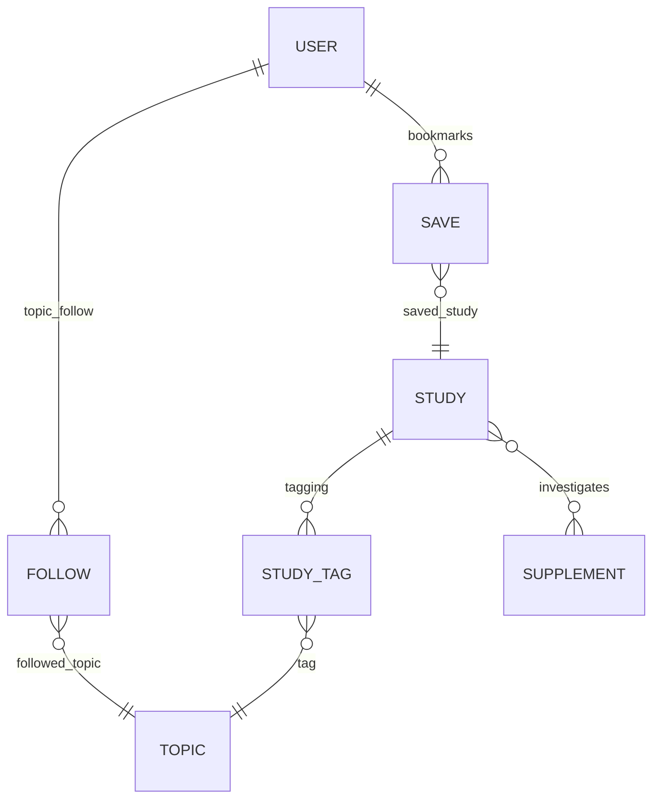

# LENS Master File

## 1. Executive Summary

LENS is the scientific research and evidence intelligence pillar of the SILO platform, providing a comprehensive engine for supplement-related studies and data. It serves as a **searchable, structured library of peer-reviewed research and regulatory data**, equipped with quality **scorecards** and AI-driven summaries to help users quickly gauge evidence credibility. LENS allows users to discover and track the latest findings on supplements and health outcomes, bridging the gap between complex clinical research and actionable insights. Key capabilities include **semantic search with retrieval-augmented AI summarization**, personalized **topic tracking with weekly digests**, and seamless **integration** with other SILO modules (like the VANTA Lab protocol builder) to translate research into personalized supplement regimens. By combining rigorous scientific scoring (based on frameworks like RoB2 and GRADE) with user-centric features (saves, follows, digests), LENS enables evidence-first exploration of supplements in line with SILO’s mission to ground every recommendation in science. In summary, LENS powers SILO’s scientific credibility and product differentiation by ensuring that every health decision on the platform is backed by transparent, high-quality research evidence.

## 2. Product Vision & Use Cases

**Vision:** The vision for LENS is to become the go-to evidence engine that **demystifies supplementation** and builds trust through transparency. LENS is designed to cut through marketing hype and conflicting information by surfacing rigorous scientific studies and making them **accessible and personalized**. It upholds SILO’s broader mission of bringing clarity and confidence to supplement use, ensuring that users – whether biohackers, caregivers, or anyone pursuing wellness – can make informed decisions backed by the latest research. By integrating seamlessly with personalized protocol tools (VANTA Lab) and community insights (COMPASS), LENS positions scientific evidence at the core of the user experience. The motto guiding its UX is *“From goal to dose in minutes,”* emphasizing that a user should be able to go from a health goal or question to a data-driven supplement decision rapidly and confidently.

**Core Use Cases:**

* *Evidence Exploration:* A user has a specific health goal or question (e.g., "Does **magnesium** improve sleep quality?"). Using LENS, they can search the library and get **peer-reviewed studies** on magnesium and sleep, complete with quality scores and plain-language summaries. This helps the user understand what works and why, without needing to parse dense academic papers.

* *Personalized Research Updates:* A health enthusiast wants to stay updated on a topic like **“omega-3 and heart health.”** They **follow** this topic in LENS and receive a **weekly research digest** highlighting new high-quality studies. Over time, LENS becomes their personalized “research radar,” alerting them to important evidence updates relevant to their interests and supplement regimen.

* *Protocol Validation:* A user building a supplement stack in VANTA Lab wants to validate their choices. For example, if they consider adding *Ashwagandha* for stress, LENS provides a **summary of evidence** (e.g. key findings from RCTs on Ashwagandha’s effects on cortisol and anxiety) and a **quality scorecard** for those studies. This evidence-first approach gives the user confidence that their protocol has scientific backing. With one click, they can then **import Ashwagandha** into their regimen via VANTA Lab if the evidence suits their needs.

* *Regulatory & Safety Checks:* A caregiver hears about a new herbal supplement and searches LENS. In addition to research studies, LENS surfaces any **regulatory alerts or safety data** (e.g. an FDA advisory or recent recall) relevant to that ingredient. This use case highlights LENS’s role in not only finding efficacy data but also ensuring users are aware of legality and safety considerations for supplements.

* *Investor/Clinician Insights:* For external stakeholders, LENS demonstrates how SILO differentiates itself via an **evidence-driven approach**. An investor reviewing LENS can see a structured pipeline: data ingestion, scoring, search, and AI summarization – showcasing a defensible technology stack. A clinician or researcher can appreciate the inclusion of established appraisal methods (like Cochrane’s bias tool and GRADE criteria) to maintain scientific rigor in a consumer app. These use cases underline that LENS is built not just for end-users’ convenience but also to meet a high standard of credibility and depth expected by expert stakeholders.

In all, the product vision for LENS is to empower users to make every supplement decision **evidence-first and personalized**, and the above scenarios demonstrate how LENS brings that vision to life in practical user journeys.

## 3. Key Features & User Stories

LENS offers a robust set of features that collectively turn a static research repository into an interactive, personalized evidence intelligence system. Below are the key features along with user story examples illustrating their value:

* **Searchable Research Library:** LENS provides a **unified search** interface to query a structured database of supplement studies and regulatory documents. Users can perform keyword-based or semantic searches to find relevant papers by compound, health outcome, or study author. *User Story:* *As a user curious about **vitamin D and depression**, I can search LENS and instantly see a list of relevant studies ranked by relevance, along with summaries and quality scores. This helps me quickly understand the consensus of evidence on vitamin D’s impact on mood.* The search results are drawn from a vetted library, ensuring that each item is a peer-reviewed source or official regulatory update.

* **Research Quality Scorecards:** Each study entry in LENS comes with a **scorecard** that evaluates its quality, methodology, and relevance. The scorecard is powered by a hybrid scoring model incorporating **RoB2** (risk-of-bias assessment for trials), **GRADE** evidence grading, and SILO’s custom criteria. *User Story:* *As a user browsing a study on **omega-3 for anxiety**, I can glance at the scorecard and see that it’s rated “Low Risk of Bias” (RoB2) and “Moderate Quality Evidence” (GRADE) with a high sample size, giving me confidence that the findings are robust.* If a study has flaws (e.g., no control group or small N), the scorecard flags these issues (like “High bias risk” or “Low confidence”) so users understand the limitations. This feature builds trust by transparently **flagging conflicts of interest or methodological issues** instead of hiding them.

* **Semantic RAG-Based Summaries:** LENS leverages **Retrieval-Augmented Generation (RAG)** to provide on-demand **natural language summaries** of research. When a user selects a study or asks a question, the system can retrieve the most relevant chunks of text and feed them to an LLM (e.g. GPT-4) to generate a concise summary or answer, complete with references. *User Story:* *As a user who finds a 12-page clinical trial daunting to read, I hit “Summarize” in LENS. The system returns a 3-sentence plain-language summary: “This RCT found that **berberine lowered fasting blood sugar** by \~15% in 12 weeks. The trial was placebo-controlled and had 100 participants, indicating moderate evidence strength.”* The summary includes **citations** to the source material and even notes the study’s quality (e.g., if it’s low-quality, the AI might add a disclaimer). This feature ensures **accessibility** of complex research and helps non-experts quickly grasp key findings without misinterpretation.

* **One-Click Supplement Import (Integration with VANTA Lab):** LENS doesn’t just present information – it enables action. If a user is convinced by evidence for a supplement, LENS offers a **one-click import** to add that supplement (and its suggested protocol) into the user’s regimen in **VANTA Lab**. *User Story:* *After reading several positive studies about **creatine for muscle recovery**, I click “Add to My Stack”. LENS seamlessly sends the supplement info (dose, form, etc., when available) to VANTA Lab’s protocol builder. When I switch to VANTA Lab, creatine is pre-loaded into my stack draft with a citation of the study I was looking at.* This tight integration shortens the path from “reading evidence” to “applying evidence” – fulfilling the “goal to dose in minutes” promise. It also ensures continuity: the context (e.g., recommended dosage from the study) can travel with the import, aiding the user in setting up their plan.

* **Tag-Based Topic Following & Weekly Digests:** Users can **follow topics** of interest – which could be a specific compound (e.g., “NAD+”), a health condition (e.g., “cognitive decline”), or a category (e.g., “immunity”). LENS treats these as tags and will monitor new research indexed under those tags. Followed topics feed into a **personalized weekly research digest**: an email or in-app notification that highlights new high-quality studies or news in those areas. *User Story:* *As a user focused on longevity, I follow “telomere length” and “NAD+” topics. Each week, LENS sends me a digest: “2 new studies on NAD+ were published this week – one in *Cell Metabolism* linking NAD+ to muscle aging. Click to read summaries.”* This digest is **tailored** to what each user cares about, ensuring they stay up-to-date effortlessly. It encourages regular engagement and learning, turning LENS into a personal research assistant.

* **Study Save/Bookmark System:** Logged-in users can **save** studies or articles for later reference with one click (like bookmarking). All saved items are accessible in a “My Library” or directly on the **user’s dashboard** under saved articles. *User Story:* *While researching, I come across a lengthy systematic review on probiotics. I save it so I can read it on my own time. Later, on my dashboard, I see all my saved papers, organized by topic. I can also see if any of those papers have gotten updated scorecards or if newer studies on similar topics have emerged.* The save system encourages deeper dives and lets users build their own collection of evidence. It also feeds into other features: for example, **saved studies can be considered in the Analytics Engine** (if the user engages with certain research, SILO might highlight related insights).

* **User-Specific Research Feed (Logged-In vs Logged-Out):** LENS tailors its content based on user state. Logged-out users can search and read basic summaries but will see a **generalized view** of content. Certain features (saving, following, personalized digests) require login. The UI for logged-in users includes a **“For You” research feed** on their dashboard – e.g., recently added studies in their followed topics, or relevant new evidence based on their profile (goals, current supplements). Logged-out users, by contrast, might see only trending or featured studies to showcase LENS’s value. *User Story:* *A new visitor can search LENS freely (e.g., see that it has rich content on “melatonin and sleep”), but to **access personalized alerts or bookmark studies**, they are prompted to create an account.* This model ensures the core knowledge is open (supporting SILO’s credibility and SEO) while premium or interactive features are tied to user accounts, driving sign-ups.

* **Feedback & Community Forum:** LENS integrates a basic **feedback forum system** where users can post ideas, feature requests, or report issues, and other users (and the team) can **vote** and **comment** on them. *User Story:* *After using LENS, I wish there was a way to filter studies by sample size. I go to the Feedback section and post this suggestion. Other users upvote it, and a SILO moderator replies acknowledging it’s planned.* This fosters a sense of community and continuous improvement. The forum likely implements threaded **replies** and vote counts, with statuses (e.g., “Planned”, “In Progress”) visible if the team uses it to update on feature development. It not only collects valuable user input but also signals to investors that SILO actively engages its user base to refine the product.

Together, these features position LENS as a **holistic research hub** – not just a static database, but an interactive platform that educates users, adapts to their needs, and connects evidence to action. Each user story above highlights the real-world benefit: from speeding up research comprehension to seamlessly incorporating evidence into personalized plans, LENS is engineered to make high-quality supplement science **usable for everyone**.

## 4. UX Design & Interaction Flows

LENS’s UX is designed to make complex scientific information easily navigable and actionable. The interface follows SILO’s overall ethos of **clarity and functional minimalism**, guiding users from questions to evidence to decisions with minimal friction. Below, we outline the major interaction flows and UI considerations for LENS:

### **Search and Results Flow:**

* **Search Bar & Filters:** At the core of the LENS UI is a prominent search bar where users can enter queries (e.g., supplement names, health outcomes, keywords). The design supports both simple queries (“vitamin C”) and complex ones (“vitamin C immune function RCT”). Users can refine results with filters such as **study type** (RCT, meta-analysis, etc.), **publication date**, or **quality score**. *Flow:* The user types a query and hits enter – immediately, a results list populates.

* **Results List (Study Cards):** Each search result is presented as a **Study Card**, summarizing the key info: title, authors, year, journal/source, and a short summary or relevant excerpt. Importantly, the card also displays **badges or icons for quality metrics** (for example, a badge for “Low Bias” or an overall score out of 100). If the user is logged in, the card will also show interactive options: a “Save” bookmark icon, a “Follow Topic” tag icon, and the “Import to VANTA” button if applicable. *Flow:* The user scrolls through results; at a glance, they can pick out high-quality studies by these visual cues (e.g., a green checkmark icon might indicate a high-quality study).

* **Study Detail View:** Clicking a result opens the **study detail page** (or modal). This page provides a structured breakdown: the **abstract and conclusion** (either full text or an AI-generated summary), the **scorecard details** (with breakdown by criteria: methodology, evidence strength, etc.), and **tags** for topics/goals. If the user is logged in, this page also shows controls to save the study, follow the tags (topics), and possibly discuss or comment (if a community discussion on studies is supported in the future). The UI emphasizes clarity: important findings might be highlighted in bold, and any **conflict of interest statements** or funding sources are explicitly shown (surfaced by the NLP engine’s entity extraction). *Flow:* On the study page, a user might click “Summarize” to see a generated summary, or expand sections like “Methods” if they want deeper details. They can also navigate via tags – clicking a tag (e.g., “Sleep”) takes them to a topic page with related studies.

* **Topic Pages:** When a user clicks on a topic tag (like a supplement name or health condition), LENS displays a **Topic Overview Page**. This page serves as a curated hub for that topic, showing top studies, recent publications, and an option to **Follow** the topic. If the user is logged out, they see the content but a prompt to log in to follow. Logged-in users see whether they are already following and can manage their subscription. The design might include a brief **AI-generated synopsis** of “What do studies generally say about \[Topic]?” to provide context. *Flow:* A user on a “Vitamin D” topic page can quickly decide to follow it, and they might click on “Weekly digest settings” to ensure they’ll get updates.

### **Saved Items & Dashboard Integration:**

* **Saved Studies List:** Saved articles are accessible through a “My Library” section. The UX likely integrates this into the main Dashboard (Home) pillar of SILO. For instance, on the user’s dashboard homepage, a widget might show “Saved Articles & Research Alerts” listing the most recent saves and any new alerts (like “New study in a topic you saved”). The saved list is ordered by date or grouped by topic. Each entry shows if new related content is available (e.g., “Newer study published after this one” or “Retraction notice” if applicable, emphasizing LENS’s dynamic tracking of research status).

* **Annotations (future):** While not in MVP, the design anticipates a possible **annotation feature** where users can highlight parts of a study or add personal notes. This could be presented as an overlay or sidebar in the study detail view. If implemented, a user reading a study could highlight a sentence (e.g., a result) and save a note like “This dose is relevant to my stack.” These annotations would be private and stored for the user, retrievable in their saved items view. *Flow (future concept):* User highlights text -> selects “Add note” -> enters note -> note icon appears next to the study in their library.

* **Logged-In vs Logged-Out UI Distinctions:** The interface subtly adapts based on authentication:

  * *Logged-Out:* The user can search and read summaries freely (showcasing LENS’s value). However, certain actions (save, follow, import to VANTA) will prompt login. For example, a “Save” button click might pop up “Log in to save articles and receive updates.” The logged-out state might also limit the number of results or detail visible (to entice sign-up without entirely gating content).
  * *Logged-In:* The UI will incorporate user-specific elements like “For You” sections, as mentioned. The header may show notifications (e.g., a bell icon indicating new digest items or replies to their feedback forum posts). Additionally, LENS content might be prioritized to the user – e.g., if their profile says their goal is “sleep improvement,” the LENS home page might feature “Sleep-related research” by default.

### **User Interaction Flows:**

* **Flow: From Search to Adding Supplement** – *Narrative:* John searches LENS for “ashwagandha stress anxiety RCT”. He sees a list of studies. One has a high-quality badge and a summary: “Ashwagandha significantly reduced anxiety in a randomized trial vs placebo.” He clicks it, reads details, and likes the evidence. He clicks “Import to VANTA Lab.” A confirmation dialog might appear (“Add Ashwagandha (300mg daily) to your stack?”). He confirms, possibly chooses which stack if he has multiple, and then a success message appears (“Ashwagandha added to your protocol draft in VANTA Lab”). John can continue researching or switch to VANTA Lab to adjust dosage. Throughout, the UI kept him in context – after adding, it might even suggest “View protocol” or “Find brand options in AEGIS for Ashwagandha,” linking to the next steps.

* **Flow: Following a Topic and Receiving Digest** – *Narrative:* Maria is reading about “NAD+ and aging.” On a study page about NAD+, she clicks the tag “NAD+” and lands on the topic page. She hits “Follow.” The UI indicates success (“You will receive weekly updates for NAD+”). That weekend, the system compiles the digest. Maria gets an email (or an in-app notification) with a summary: “This week in your followed topics: 1 new study on NAD+ (click to read summary).” When Maria clicks it, she’s taken to LENS where the new study summary is displayed, with an icon highlighting it’s *new*. The digest email is cleanly formatted with the SILO branding, and for each item it provides a direct link into LENS. In-app, if she checks her Dashboard’s research alerts section, the same content is visible. The interaction is simple: Maria doesn’t have to constantly check LENS – it *pushes* relevant info to her, which she can then pull more details on if desired.

* **Flow: Using the Feedback Forum:** The feedback forum might be accessible via a “Feedback” link in the LENS (or overall platform) navigation. On clicking, the user enters a dedicated forum area. They see a list of posts (each maybe a card showing title, number of votes, status). They can filter by tags like “Feature Request” or “Bug”. If Maria wants to request a feature, she clicks “New Post”. The UI presents fields: title, description, category. She writes her suggestion and submits. Immediately, her post appears with a vote count (starting at 1 with her own vote automatically). Other users can click an upvote icon on posts, and add replies. The UI for a post shows replies threaded beneath, perhaps with slight indentation. Official responses by SILO team might be highlighted or labeled (e.g., “Team” or a colored badge). Maria later returns and sees a developer has replied to her: the forum might notify her via email or an in-app notification (“Your post received a reply from SILO team”). This integration keeps users engaged and valued. The design aim is **simplicity and familiarity** – likely similar to popular feedback boards (like Canny or UserVoice), making it intuitive.

Overall, the LENS UX is **clean, data-rich, and context-driven**. Scientific data is presented with visual cues (badges, tags, summaries) to reduce cognitive load. Navigation flows are crafted so that a user can fluidly move from discovering evidence to applying it, or from following a topic to getting updates, **without getting lost in complexity**. At each step, LENS provides the right amount of detail or action: search leads to discovery; discovery leads to either deeper reading (scorecards, full text) or direct action (import to stack). This ensures both casual users and power users find the interface accommodating – casual users get quick answers, while power users (like those who want to read full PDFs or dig into methods) have that option available through links or expanded sections. By aligning the interaction flows with user goals, LENS’s UX delivers an experience where evidence-based decision-making feels natural and efficient, not cumbersome.

## 5. Study Scoring System (Design + Rules)

A cornerstone of LENS is its **research quality scoring system**, which provides users with an at-a-glance assessment of how trustworthy and relevant each study is. The design of this scoring system draws on established academic frameworks while incorporating SILO’s custom rules to tailor it for supplement research. The outcome is a **scorecard** for each study that covers multiple dimensions of quality:

* **Methodological Rigor (RoB2-based):** LENS uses criteria from the Cochrane **Risk of Bias 2 (RoB 2)** tool to judge each trial’s internal validity. RoB2 evaluates domains such as randomization, blinding, missing data, and outcome reporting. In LENS, these qualitative judgments are translated into a simple indicator (e.g., *Low Risk*, *Some Concerns*, or *High Risk* of bias). For example, a randomized controlled trial (RCT) with proper blinding and low dropout might get a “Low Risk of Bias” label. Conversely, an open-label trial or one funded by an interested supplement manufacturer might be flagged with “High Risk” due to potential bias. This RoB2-derived score is key for users to understand if a positive result is likely reliable or possibly skewed.

* **Evidence Strength (GRADE-inspired):** Borrowing from the **GRADE** methodology, LENS rates the **quality of evidence** provided by the study on a four-level scale: High, Moderate, Low, Very Low. An RCT starts as High evidence by default in GRADE, whereas observational studies start lower. LENS adapts this: e.g., a well-conducted RCT on a supplement outcome would be “High” or “Moderate” evidence (moderate if minor issues or if it’s a small trial), a cohort study might be “Low” unless it has exceptionally strong data or multiple corroborating studies, etc. The GRADE perspective also considers consistency of results and directness: thus, a single small study might be Moderate at best even if bias is low, whereas a meta-analysis of many RCTs would be High evidence. This helps users gauge *how much confidence* to place in the findings – a “High” grade suggests we can be quite confident in the effect, while “Low” means the findings could well change with more research.

* **Sample Size & Statistical Power:** As part of SILO’s custom scoring, the system looks at the **population size** and design of the study. A study with 500 participants gets a boost in the score compared to one with 20 participants, all else equal. Likewise, having a control group, being randomized, and reaching statistical significance are factored in. The NLP pipeline automatically scans abstracts for phrases like “N=”, “p<0.05”, etc. Studies are tagged with size categories (small/medium/large) and whether they demonstrated significant effects or not. These factors feed into an overall numeric score or rating. For instance, a large double-blind RCT that showed clear positive results might score, say, 90/100, whereas a small pilot study might score 50/100 even if results were interesting (due to higher uncertainty).

* **Relevance & Alignment to SILO Context:** This is a custom dimension where LENS considers how directly applicable the study is to typical SILO users’ interests:

  * **Population Match:** Human studies are scored higher than animal or in-vitro studies for user-facing recommendations. Within human studies, those on healthy volunteers or populations similar to users (e.g., adults without major diseases, if the user base is general wellness) are noted. If a study is on a very specific demographic (say, elite athletes or patients with chronic disease) that might limit generalizability, the scorecard might indicate that (“Specific Population” flag).
  * **Intervention Details:** A study that uses a supplement form or dose commonly available to consumers is rated more relevant. For example, a study on Vitamin E at a mega-dose of 2000 IU daily might be flagged, whereas one using a standard 400 IU would be more applicable.
  * **Outcome Relevance:** Outcomes that relate to common user goals (sleep quality, energy, blood markers like cholesterol, etc.) are considered more directly useful than niche biochemical endpoints. LENS might tag studies with outcome categories (e.g., “sleep latency” vs “oxidative marker X”) and weigh them in relevance.

* **Transparency and Conflicts of Interest:** LENS actively surfaces any **conflicts of interest (COI)** reported in studies. The NLP engine’s entity recognition can detect if a study mentions funding from a supplement company or if an author is affiliated with an industry group. If a potential COI is present, the score may be adjusted downward or at least flagged on the scorecard (e.g., “Industry-funded study” warning). Similarly, if a study is pre-registered or has open data (signs of transparency), it might get a positive note. This encourages trust: users see that SILO is critical and not blindly accepting studies at face value.

**Scorecard Presentation:** The combination of the above factors is distilled into a user-friendly display:

* A possible visualization is a **radar chart or bar chart** showing multiple criteria (Methodology, Sample Size, Consistency, Directness, etc.), or simply a list of graded categories (e.g., *Bias Risk: Low; Evidence Level: Moderate; N=50 (Small); Conflict: None noted*).
* An **overall score** might also be provided (e.g., 0–100 or 0–5 stars). For example, “SILO Score: 82/100 (Good)” could be shown, which is not just an average but a weighted result of all factors. The weightings might be tuned such that methodological rigor and evidence level carry the most weight, since a large flawed study shouldn’t outrank a small high-quality RCT.
* The scorecard is available at a glance on each study’s listing. Users interested in details can expand it to see the breakdown and definitions (“What is GRADE? What does Low Bias mean?” possibly linking to a Glossary or tooltip).

**Automated vs Manual Aspects:** Initially, much of this scoring may rely on a **rule-based NLP pipeline** that automatically parses study text for key indicators. For example:

* If abstract contains “randomized placebo-controlled trial” => likely low bias potential.
* If no control group is mentioned => mark methodology down.
* Check if results mention p-values or confidence intervals => if not, maybe observational or qualitative study (which might lower evidence strength scoring).
* Identify phrases from GRADE’s criteria (like “systematic review” might boost evidence, or “pilot study” might reduce it).

These rules generate a draft scorecard. In early phases, the SILO team might manually review and override scores for key studies to ensure accuracy (since NLP might not catch nuance). Over time, as data grows, a **ML model** could be trained to predict scores (tier 2 intelligence), but at launch it’s primarily deterministic rules for reliability.

**Calibration and Examples:** To illustrate the scoring rules, consider two examples:

1. *Example A:* **Double-blind RCT**, 100 participants, on creatine’s effect on muscle recovery. Results: significant improvement in muscle strength vs placebo. No conflicts of interest reported.

   * Bias: Low (proper blinding/randomization)
   * Evidence: High (RCT with robust results)
   * Sample: Medium (100 is reasonably powered)
   * Relevance: High (recreational adult athletes as subjects, outcome = muscle strength which is relevant to users)
   * Overall: This might score \~90/100. Scorecard might read “High Quality: This randomized trial provides high-confidence evidence that creatine improves muscle recovery in adults.”

2. *Example B:* **Observational cohort**, 30 people, on a new herbal mix’s effect on sleep, with no control group. Funded by the company making the supplement.

   * Bias: High (no control, non-randomized, possible placebo effect)
   * Evidence: Very Low (observational, tiny sample)
   * Sample: Very small (30)
   * Relevance: Moderate (outcome is sleep quality which is relevant, but the herbal mix might not be a standard supplement formulation)
   * COI: Present (industry-funded)
   * Overall: This might score \~40/100. The scorecard would clearly flag “Uncontrolled study, very low confidence” and note the conflict. Users are cautioned to interpret the findings as preliminary.

By presenting these scores and notes, LENS empowers users to critically evaluate research at a glance. This design follows a **clinical-technical tone** – it’s evidence-based and somewhat conservative in ratings, much like a clinician would appraise literature. For the user, the benefit is twofold: they gain insight into study credibility (not all “studies” are equal, and LENS makes that clear), and they also become educated about research quality concepts through the tooltips and consistent exposure to these scoring terms (e.g., they learn what constitutes a high-quality study vs a low-quality one).

In summary, the LENS study scoring system is a **blend of Cochrane’s rigor and SILO’s context-awareness**. It uses RoB2 and GRADE to ensure classical standards of evidence evaluation, and augments them with practical considerations for supplement users (like real-world relevance and safety flags). This provides a **comprehensive “at-a-glance” assessment** for each study, enhancing user trust and helping prioritize which evidence carries more weight when making health decisions.

## 6. NLP + RAG Architecture

LENS employs a modern **NLP and Retrieval-Augmented Generation (RAG) architecture** to turn its repository of studies into interactive insights. This architecture is designed to seamlessly integrate *search* and *generation*, allowing the platform to deliver concise answers and summaries grounded in the actual research data. Below, we detail the components and flow of this system, as well as how it’s implemented to ensure accuracy and performance.

### **RAG Pipeline Overview:**

```mermaid
flowchart LR
    subgraph LENS RAG System
        direction LR
        UserQuery["User Query or Request<br/>(e.g. question or topic)"] -- 1. Embed & Search --> Retriever[(Vector & Keyword<br/>Retrieval Engine)]
        Retriever -- "Top-N relevant chunks" --> ContextDB[/"Research Chunks<br/>(title, abstract, conclusion)"/]
        ContextDB -- 2. Retrieved context --> Prompt[[LLM Prompt<br/>(Structured with citations)]]
        Prompt -- 3. Summarize with context --> GPT[GPT-4 Summarization Model]
        GPT -- 4. Response with citations --> Answer["Answer / Summary"]
    end
    UserQuery -.-> Answer
```

*Figure: High-level RAG flow – the user’s query triggers a hybrid search, retrieved text is combined into a prompt for GPT-4, and the model returns a summary with citations back to the user.*

1. **Vector Store & Indexing:** LENS maintains a **vector database** of embedded study content. Key sections of each paper (titles, abstracts, conclusions, and any important segments) are **embedded into high-dimensional vectors** using a Transformer model (e.g., *all-MiniLM-L6* or similar). Each embedding vector is stored alongside metadata such as the study ID, source, and tags (like which supplement or outcome it relates to). The platform uses **Supabase pgvector** for this purpose, making Postgres itself the vector store. *(Pgvector is a Postgres extension enabling vector similarity search on embeddings.)* This setup means LENS can do semantic searches internally without calling external APIs for similarity lookup. The database also has a full-text index for keyword searches (BM25) – essentially two parallel indices.

2. **Retrieval (Hybrid Search):** When a user makes a query – for example, “Summarize findings on magnesium and sleep quality” – the system performs a **hybrid search**:

   * A **full-text BM25 search** scans the `tsvector` index of study texts for keywords “magnesium” and “sleep” to get a set of candidate documents with lexical matches.
   * A **semantic search** takes the embedded query vector (embedding of the user’s query sentence) and finds the closest vector matches in the pgvector index (which finds studies contextually about magnesium and sleep even if wording differs).
   * The results from both are then **fused**. LENS uses techniques like **Reciprocal Rank Fusion (RRF)** to merge the lists: each document’s rank from each method is combined into a score. This ensures that a study highly relevant in both semantic and keyword terms rises to the top, and even if a relevant study doesn’t have exact keyword matches, it can still appear due to semantic similarity. RRF, specifically, gives higher weight to items that appear in both lists and penalizes those that are low-ranked in one list. The output is a ranked list of top *N* relevant **chunks** of text (e.g., specific paragraphs from papers).

   The retrieval step is optimized for speed: Postgres handles the heavy lifting, and indexes (GIN for text, HNSW for vector) allow queries to be fast even as the library scales.

3. **Prompt Construction:** The top-N retrieved chunks (let’s say top 3–5 passages from various studies) are then assembled into a **structured prompt** for the large language model. The prompt typically follows a template:

   * A **system message** that sets the tone and instructions for the AI (e.g., “You are an expert assistant that provides scientific summaries. Always cite sources from the provided text. Do not make up information.”).
   * A concatenation of the retrieved chunks, each annotated with a reference number or token so the AI can cite them.
   * A user question restatement if needed, or simply the question, possibly augmented (like “Based on the studies above, summarize how magnesium affects sleep quality.”).

   The system may also inject a brief **dynamic context** about the user if relevant (for example, if the summary is being generated in VANTA Lab context, it might add: “The user’s goal is sleep improvement, focus on outcomes related to sleep.”). However, user personal data is not directly given to the model, preserving privacy (sensitive user inputs are anonymized or excluded).

4. **Generation (OpenAI GPT-4):** The prompt is fed to the **GPT-4 model** (via OpenAI’s API) for generation of the answer. GPT-4 (or a similar top-tier LLM) is used because of its capability to synthesize information and maintain context from multiple sources. The model generates a **summary or answer** that explicitly **integrates the retrieved content**. Thanks to prompt instructions, it will **cite** the sources (e.g., “\[1]” referencing the first chunk, which corresponds to a specific study). The answer might look like: “Magnesium supplementation has been associated with improvements in sleep quality, particularly in older adults with insomnia, in several studies. One randomized trial reported longer sleep time and reduced insomnia severity for magnesium vs placebo, though more research is needed to confirm across broader populations.” The bracketed citations correspond to those chunks.

5. **Output and Post-processing:** The LENS front-end receives the AI’s response. The system may do some light post-processing: for example, attaching the full citation details to the reference indicators (so the user can click the citation to see the study title/source). It might also append a disclaimer for medical safety (“This summary is for informational purposes and not medical advice.”). Additionally, if the AI’s confidence (which might be gleaned from its own format or an internal evaluation) is low or if sources are older than a certain threshold, LENS could include a note like “Note: Some references are over 10 years old, consider more recent research.” (This aligns with the design where responses may include **flags for low-scoring or outdated references**).

**Prompt Engineering:** The team has invested in prompt engineering to ensure the AI’s tone and output match SILO’s requirements:

* The assistant is instructed to maintain a **clinical-technical tone** – meaning it should be precise, cautious in inference, and avoid prescribing. For instance, it won’t say “You should take X,” but rather “Studies suggest X may be effective.”
* The AI also follows transparency guidelines: *if evidence is conflicting or not strong, it should say so*. An example prompt might include: *“If the research is inconclusive or contradictory, state that clearly and do not force a conclusion.”*
* Few-shot examples are provided in the system or developer prompt (e.g., demonstrating how to cite, how to phrase uncertainties like “small sample” or “needs more studies”). Example: “**User:** List the top-cited studies on berberine and insulin sensitivity. **Assistant (example):** 1. Smith et al 2018 – Berberine improved insulin sensitivity in obese patients… 2. \[Next study] …” This trains the model in format.

**Balancing OpenAI and Internal Models:** While GPT-4 via OpenAI is used for the highest quality output, the architecture is modular:

* For sensitive data or cost-saving in certain scenarios, SILO has an option to use an **open-source model** hosted on its own infrastructure (for instance, a fine-tuned Llama or a smaller GPT-3 equivalent for summarization tasks that don’t require the full power of GPT-4). This ensures the system can still operate if API costs or limits are an issue, albeit possibly with simpler summaries.
* The embedding model (MiniLM or similar) is an **internal component** (likely running on the Supabase edge functions or a small inference server) so that we don’t have to call external APIs for each search query’s embedding. This reduces latency and cost, and any domain-specific tuning (e.g., perhaps using a PubMedBERT for biomedical text) can be applied.

**Use Cases of NLP beyond QA Summaries:**
The NLP stack isn’t only for Q\&A. As noted earlier, it also:

* **Auto-generates study summaries and tags:** When new studies are ingested, an NLP routine can summarize the abstract into a 2-3 sentence plain language highlight that is stored in the database for display in search results (especially Phase 1/2 when not all summarization was on-the-fly). It can also extract entities like supplement names, health conditions, outcomes measured, etc., to assign tags automatically.
* **Feeds the study scoring pipeline:** The NLP scans for key terms in methods (like “randomized” or “placebo”) to assist in assigning scores, as described in Section 5.
* **Enables digest creation:** For weekly topic digests, the NLP system might generate the short blurb for each study (so the digest email says “Study X found Y…” rather than just listing titles). It can also rank which studies are most noteworthy via a combination of score + semantic relevance to the user’s profile (e.g., emphasize human studies if the user is tracking human outcomes).

**Accuracy and Safety Considerations:** By using RAG, LENS ensures that the AI’s outputs are **grounded in actual data**. This greatly reduces the risk of hallucinations or incorrect answers, as the model is forced to stick to the retrieved text. All AI-provided content is accompanied by citations which the user can verify themselves, promoting transparency. The system also refrains from answering beyond the evidence: if a user asks something and the research isn’t there, the AI (via its instructions) will respond along the lines of “There is no strong evidence on that topic according to available studies.” Additionally, no personal user data is sent in prompts; if a user’s question includes identifying info or very personal context, the system strips it out or generalizes it before sending to the LLM to maintain privacy.

**Performance:** The architecture is built to handle many requests in parallel. Because each query hits the Postgres (which is scalable and well-indexed) and then an external model call, the system employs caching for repeated questions or popular summaries. For instance, if many users ask about “vitamin D and immunity,” the first time the answer is generated and stored for a short period; subsequent users can get the cached summary instantly, unless there’s new research triggering an update. Also, the stateless nature of the edge functions means it can scale horizontally: multiple lambda/function instances can handle separate user queries concurrently, and the vector search is just DB queries which Postgres can handle at scale with proper indexing.

In essence, the NLP + RAG architecture in LENS brings the **power of large language models** into a controlled, factual domain of supplement research. It transforms static text into **interactive answers**, making the experience of getting evidence feel conversational and intuitive. At the same time, it maintains a high standard of accuracy and **trust (through citations and careful prompt design)** so that the outputs are as credible as the sources they’re based on. This marriage of search and generative AI is a key innovation driving SILO’s intelligent user experience.

## 7. Search System Design (BM25, Vector, Hybrid Ranking)

Searching in LENS is not a trivial keyword lookup – it’s a sophisticated system that combines traditional information retrieval with modern semantic search to ensure users find the **most relevant studies** whether or not they know the exact terms used in the literature. The design balances **BM25-based full-text search** and **vector similarity search** in a hybrid approach, leveraging the strengths of each.

**BM25 Keyword Search:**
LENS employs a Postgres full-text search (using the **Okapi BM25** algorithm behind the scenes) to handle exact term matching. BM25 is a well-established ranking function used in search engines to estimate relevance based on term frequency and inverse document frequency. For example, if a user searches “melatonin insomnia trial”, BM25 ensures that any study explicitly containing those terms (in the title, abstract, etc.) is retrieved and scored highly. The Postgres `tsvector` and `tsquery` functionalities are used:

* A `tsvector` column (e.g., `fts_content`) is generated for each study combining title, abstract, and maybe keywords.
* A search query is transformed with `plainto_tsquery` or `websearch_to_tsquery` to handle boolean logic, phrase matching, etc.
* We rank results by `ts_rank_cd` (cover density rank), which is essentially BM25, to favor documents with more occurrences of the query terms.

This handles cases where specific jargon or phrases are important (e.g., a user looking for “Meta-analysis” will specifically get those). It’s also very fast and can narrow down by conditions (we can index different language fields or filter by publication date, etc., in the SQL query).

**Vector Semantic Search:**
Alongside the keyword index, LENS uses a **vector index (via pgvector)** to perform semantic searches. Each document (or document chunk) is represented as an embedding vector in, say, 384 dimensions (depending on the model). When a user enters a query, we also embed that query text into the same vector space and perform a nearest-neighbor search (cosine similarity or inner product) to find which study embeddings are closest. This captures **conceptual relevance**. For example, if someone searches “blood sugar improvement supplement”, a semantic search could find studies on **berberine’s effect on glucose** or **metformin vs herbal interventions for insulin resistance**, even if the words “blood sugar” or “improvement” aren’t exact-matched. It understands that “improvement in blood sugar” is related to “lowering fasting glucose” or “insulin sensitivity”.

We index the vectors with an **approximate nearest neighbors algorithm (HNSW)** for scalability. The similarity metric commonly used is *inner product* if vectors are normalized, or *cosine distance*. This allows sub-second semantic retrieval even with tens of thousands of vectors.

**Hybrid Ranking Mechanism:**
The core innovation is how LENS merges these two search modes – **hybrid search**. After retrieving a set of candidates from both the BM25 query and the vector query, the results are merged to produce one ranked list. The merging algorithm used is Reciprocal Rank Fusion (RRF) as mentioned:

* Each result from either list is assigned a score = 1/(k + rank) for each list it appears in (with a small constant *k* to avoid over-weighting the first rank too much). We might use k = 60 as a default (the Supabase example uses 50). If a study is rank 1 in BM25 and rank 50 in vector, it gets 1/(1+60) + 1/(50+60) = \~0.0166 + 0.009, etc.
* Those scores are summed for each unique document. This inherently boosts items that appear in both lists (since they’ll get two contributions) and those that are high in either list (especially both).
* Sort by this fused score to get the final ordering.

The advantage of this method is **recall and precision** together: BM25 ensures highly relevant documents that contain the query terms exactly aren’t missed, and vector ensures we catch relevant docs where synonyms or implicit concepts are present.

**Example scenario:** Query “heart health supplements cholesterol”. A purely keyword search might return studies that explicitly mention “heart health” or “supplements and cholesterol” – perhaps missing a study titled “Effects of bergamot extract on lipid profiles” because it doesn’t use the word “heart”. A pure semantic search might find that bergamot study due to “lipid profiles” context but also bring something tangential like a study on “red yeast rice” because that’s a supplement affecting cholesterol (good, relevant) but maybe also something on “CoQ10 and statin muscle pain” (which is related to heart medication but not directly cholesterol – semantic can sometimes drift). The hybrid list would hopefully have:

1. Studies explicitly on cholesterol (from BM25 and also semantic recognized).
2. Studies like bergamot (semantic found, BM25 maybe not, but it appears via semantic).
3. It might include CoQ10 statin study but likely lower ranked because BM25 doesn’t support it and semantic might rank it but not top, so fusion places it but not at top.

We also incorporate **filtering** in the search design:

* Users can filter by publication year range, or by study type (we have metadata like study design tags). These filters apply to both search modes – meaning the system will restrict the candidates to those that meet criteria before fusion. Postgres can handle that in the SQL by applying `WHERE` clauses (e.g., `year > 2015` and perhaps the vector search is done via a function that can also pre-filter by year by combining an index with recheck).
* The search API might also allow sorting by newest, if the user wants chronological rather than relevance. In that case, we possibly skip vector relevance or use it only to filter and then sort by date.

**Dealing with Complexity:**
For multi-term queries, BM25 inherently handles things like weighting rarer terms. The vector search might capture the gist but sometimes vector models have limitations (like being too general or missing nuance like negation). If a user searches “Vitamin K calcium *NOT* bone” (to find something not about bones), our first version might not handle advanced boolean semantics in vector obviously, but BM25 could if we expose syntax (Postgres `!bone`). The MVP likely keeps it simple, and we expect users to do straightforward queries. Over time, if needed, we could incorporate a reranker model (e.g., a small BERT that re-evaluates the top 20 results for actual relevance) to further improve precision – but that’s phase 3+ territory.

**Pagination and Performance:**
We likely retrieve maybe top 30 from BM25 and top 30 from vector, fuse them, then show top 10 to the user in page 1. If user goes to page 2, we might have already had 60 candidates to fuse, which is usually enough for two pages after fusion. This avoids deep offset queries on the vector side (which can be expensive).

**Database Implementation:**
Following Supabase’s guidance, we might implement a **SQL stored procedure (function)** called `hybrid_search(query_text, query_embedding)` that encapsulates this logic. It would:

```sql
WITH
  bm AS (
    SELECT id, row_number() OVER (ORDER BY ts_rank_cd(fts, websearch_to_tsquery(query_text)) DESC) AS r
    FROM research_papers 
    WHERE fts @@ websearch_to_tsquery(query_text)
    LIMIT 30
  ),
  sem AS (
    SELECT id, row_number() OVER (ORDER BY embedding <=> query_embedding ASC) AS r
    FROM research_papers
    /* possibly filter same as above if needed */
    LIMIT 30
  )
SELECT id,
       SUM(CASE WHEN bm.r IS NOT NULL THEN 1.0/(bm.r + 60) ELSE 0 END 
           + CASE WHEN sem.r IS NOT NULL THEN 1.0/(sem.r + 60) ELSE 0 END) as fused_score
FROM bm FULL JOIN sem USING (id)
GROUP BY id
ORDER BY fused_score DESC
LIMIT 10;
```

Something like that. This function can be called via an API endpoint (e.g., Supabase RPC or a REST call from our edge function).

**Result enrichment:**
The search results then are enriched before returning to frontend. For each resulting `id`, we fetch the study’s title, snippet (either the abstract first lines or the matched context snippet), and scorecard info to display. If the query was a question, these results might be directly fed into the RAG pipeline as described in Section 6.

**Continuous Improvement:**
Our hybrid search will get better as we tune:

* We might adjust the constant *k* or how many from each list to consider (maybe take more from vector if we find it yields good candidates).
* In future, we might incorporate **user feedback signals**: e.g., if users often click a certain result when searching a particular query, that could boost that result’s ranking in future (learning-to-rank). This is not in initial scope but possible down the line.
* We’ll monitor search logs to see if any queries are failing (zero results). If none found, perhaps fall back to a broader vector search (lower similarity threshold) to avoid giving “no results” – instead, “no *exact* matches, but here are some related studies”.

In summary, LENS’s search system is designed for **both precision and recall**, using BM25 for precise term matches and vector search for semantic coverage. The hybrid ranking approach ensures users get a holistic result set: the obvious relevant studies plus the “you might not have known to search for this” studies. This is crucial in a domain where users might be laypersons – they might search “memory supplement study” and thanks to semantic search, they’ll find studies on specific substances like bacopa or omega-3 that improve memory, even if the user didn’t know those terms to begin with. The result is a more intuitive and empowering search experience that speaks the user’s language while understanding the researcher’s language.

## 8. Database Schema & Entity Relationships

The SILO platform’s database is structured in a modular way, with each product pillar (LENS, VANTA, AEGIS, etc.) contributing its own tables while sharing certain common entities. All data is stored in **Supabase Postgres**, leveraging relational structure, JSON for flex fields, and Row-Level Security (RLS) for multi-tenant safety. Below, we outline the key database entities related to LENS and how they interconnect.

Key entities include **Study (Research Paper)** records, **Topics/Tags**, **Users**, and join tables for user interactions like saved studies and followed topics. Additionally, LENS interacts with the **Supplement** and **Brand** entities for integration with other pillars.



*Diagram: ER model (simplified) for LENS-related entities. A user can save many studies and follow many topics; a study can be tagged with multiple topics (and vice-versa via STUDY\_TAG join). Many studies may investigate a given supplement (and vice versa). Primary keys and other tables (Brand, Stack etc.) omitted for clarity.*

**User:** The `User` table (managed by Supabase Auth) stores user profile data and preferences. Relevant to LENS, each user row might include preferences like `digest_frequency` (e.g., weekly) and flags for whether they want research emails. Non-sensitive profile attributes (age, goals, etc.) can be used by LENS for personalization (e.g., highlighting relevant studies) but are stored in the User or related Profile tables.

**Study (Research DB):** The `Study` table in the Research DB is the core of LENS. Each record corresponds to a peer-reviewed study or a relevant regulatory article. Key fields:

* `id` (primary key).
* `title`, `authors`, `publication`, `year`.
* `doi` or external link identifier if available.
* `abstract`, `methods`, `results`, `conclusion` – possibly stored or at least the chunked vector data comes from these sections.
* `score_methodology`, `score_evidence`, `score_overall` – numeric scores or categorical ratings for quality.
* `tags` – possibly a JSONB array of topic tags (could be supplement names, goal categories, etc.) for quick indexing, though in a normalized form we use a join table.
* `embedding` – the vector (as a `vector` type column for pgvector) of the study or chunk, enabling semantic search. If we store multiple chunks per study, there might be a separate table for chunks with an embedding each. But likely we index at least abstracts as one vector for now.
* Timestamps for when inserted, etc.

**Topic/Tag:** We use the term “topic” to represent any tag that can be followed. This could be an ingredient, a health outcome, or a category. There could be a `Topic` table:

* `topic_id`, `name`, `type` (e.g., “compound”, “goal”, “biomarker”, “condition”). For example, “Omega-3” (compound), “Cognitive Decline” (condition).
* Possibly fields to describe it or map to other ontologies (for instance, a topic might link to a Supplement or to nothing if it’s general).
  In some implementations, we may not need a separate table if tags are simple, but since users follow them, we want a consistent reference (so likely a table is used to avoid spelling mismatches, and to store counts etc.).

**Study-Tag Relationship:** The connection between `Study` and `Topic` could be many-to-many:

* `STUDY_TAG` table with `study_id` and `topic_id` (composite PK). This is populated when a study is ingested: either manually tagged or via NLP (e.g., if a study is about ashwagandha and anxiety, it gets topic entries for “Ashwagandha” and “Anxiety”).
  This allows queries like “find all studies for topic X” efficiently.

**User Saves (Bookmarks):** The `SAVE` table (or call it `SavedStudy`) maps users to studies they’ve saved:

* Columns: `user_id`, `study_id`, `saved_at` timestamp.
* Each row indicates that a user bookmarked a particular study. RLS rules ensure users can only see their own saves.
  This ties into the dashboard and saved library. We might also track if they added notes (could add a `note` column here if annotation feature is simple text note per save).

**User Topic Follows:** The `FOLLOW` table (or `UserTopicFollow`) captures topics a user subscribes to:

* `user_id`, `topic_id`, `followed_at`.
* Perhaps a `digest_last_sent` timestamp or `new_study_count` that resets after digest, etc., to manage notifications.
  This table is consulted by the digest engine to compile each user’s followed topics.

**Supplement:** The `Supplement` table (part of the Supplement DB) contains master records for each supplement ingredient or compound in the system. Fields:

* `supplement_id`, `name` (canonical name, e.g., “Magnesium Glycinate”), maybe `aliases` (JSONB array).
* `default_dose_range`, `units` (for providing dosage context).
* Perhaps links to key research (could be a denormalized field listing top study IDs for that supplement).
* `tags` (like compound class or use cases).
  This is heavily used by VANTA (for stack building) and COMPASS (for discovery). In LENS, it’s used to link studies to supplements.

**Study-Supplement Relationship:** Often, a study is about one or more supplements (e.g., a study of Vitamin D’s effect on immunity). We map this via a many-to-many relationship similar to topics:

* Possibly handled *through* Topic tagging if every supplement is also a topic tag. Indeed, we could treat supplement names as a subset of topics (type = compound). In that case, a study’s tags include its supplements, and following a supplement is just following that topic.
* Alternatively, have a direct join `StudySupplement` (study\_id, supplement\_id). This might duplicate info with Topic, but ensures normalization with the official supplement list.
  Given integration needs (like one-click import requires knowing which supplement to import), having the explicit link to `Supplement` entity is useful. We might indeed maintain both: store supplement tags in topics for search UI, but also maintain `StudySupplement` for direct functional link. This join can be populated via NLP entity recognition (searching text for supplement names).

**Brand & AEGIS Integration:** AEGIS’s Brand DB holds info on supplement brands and products. This is somewhat peripheral to LENS, but there is an integration: we flag conflicts of interest if a study involves a particular brand or if authors have ties. We likely have:

* `Brand` table (brand\_id, name, etc.).
* Possibly an `Author` table or simple fields in Study for author names (for COI linking).
  We might maintain a mapping of brand names or known companies to watch for in papers. But for now, this connection is likely not fully automated – instead, the NLP might catch “Company X” in funding and then match to Brand DB to display profile (like “This study was funded by \[BrandName], which has a low AEGIS score”).

**Entity Relationships Summary:**

* A **User** can save many studies (`User 1 - M Save`), and each **Study** can be saved by many users (M - 1 via Save) – hence the join table.
* A **User** can follow many topics (`User 1 - M Follow`), each **Topic** can have many followers – join table.
* A **Study** can have multiple tags (`Study 1 - M StudyTag`), each **Topic** tag can label many studies – join.
* A **Study** can involve multiple supplements, each **Supplement** appears in many studies – this is many-to-many as well. If using a `StudySupplement` join, that’s similar structure.
* The **Supplement** to **Topic** relationship: if every supplement is also a topic, then supplement following is just topic following. Alternatively, if separate, one could follow a supplement specifically (which under the hood might just follow the corresponding topic entry of type compound).
* **User preferences** like digest might live in user table or a separate `UserSettings` table.

**Database Schema (Excerpt):**

To illustrate, here’s a simplified definition of some tables:

```sql
-- Research study table
CREATE TABLE research_study (
  id            SERIAL PRIMARY KEY,
  title         TEXT,
  authors       TEXT,
  journal       TEXT,
  year          INT,
  doi           TEXT,
  abstract      TEXT,
  conclusion    TEXT,
  score_methodology INT,
  score_evidence    INT,
  score_overall     INT,
  embedding     VECTOR(384),       -- pgvector column
  created_at    TIMESTAMP,
  updated_at    TIMESTAMP
);

-- Topic table
CREATE TABLE topic (
  id    SERIAL PRIMARY KEY,
  name  TEXT UNIQUE,
  type  TEXT CHECK(type IN ('compound','condition','outcome','other'))
);

-- Study-Tag join
CREATE TABLE study_tag (
  study_id INT REFERENCES research_study(id),
  topic_id INT REFERENCES topic(id),
  PRIMARY KEY (study_id, topic_id)
);

-- Supplement table
CREATE TABLE supplement (
  id    SERIAL PRIMARY KEY,
  name  TEXT UNIQUE,
  default_unit TEXT,
  min_dose NUMERIC,
  max_dose NUMERIC
  -- etc.
);

-- Study-Supplement join
CREATE TABLE study_supplement (
  study_id INT REFERENCES research_study(id),
  supplement_id INT REFERENCES supplement(id),
  PRIMARY KEY (study_id, supplement_id)
);

-- User save table
CREATE TABLE saved_study (
  user_id UUID REFERENCES auth.users(id),  -- Supabase auth UID
  study_id INT REFERENCES research_study(id),
  saved_at TIMESTAMP DEFAULT now(),
  PRIMARY KEY (user_id, study_id)
);

-- User follow table
CREATE TABLE followed_topic (
  user_id UUID REFERENCES auth.users(id),
  topic_id INT REFERENCES topic(id),
  followed_at TIMESTAMP DEFAULT now(),
  PRIMARY KEY (user_id, topic_id)
);
```

*(Note: Actual schema might differ; Supabase’s `auth.users` holds user info, we typically reference by user ID.)*

**Row-Level Security & Access Control:**
RLS policies are crucial:

* On `saved_study` and `followed_topic`, policies ensure a user can only insert their own user\_id (usually by using Supabase’s authenticated user context) and select/delete those rows belonging to them.
* On `research_study` and related read-only tables (topics, supplements), we might allow read access to everyone (since study data isn’t private). If some content is premium, we could restrict certain fields or certain rows (e.g., maybe only logged-in can see full abstract text vs summary, depending on content strategy).
* We also consider that if any user annotations or comments were added, those too would have RLS (only you or involved users see them, or if it’s a public forum a different mechanism).

**Entity Relationship with Other Pillars:**

* **VANTA Lab (Stacks):** The `Stack` and `StackItem` tables in VANTA reference supplements (via supplement\_id) and possibly link to research: E.g., a StackItem might have a `source_study_id` if it was added via LENS (to know which study justified it). Or at least, when importing, we might pass along a reference that gets logged. The `Stack DB` shares data with RAG as noted (so RAG can link a supplement in a user’s stack to relevant studies).
* **Compass (Discovery):** Compass might have a table for trending topics or logs of user actions. LENS could push aggregated data such as “most followed topics” or “most saved studies” for Compass to display trending research.
* **AEGIS (Brand):** If we store conflict info, we might have a `study_brand` table if a study explicitly involves a product (e.g., “Study on \[BrandX]’s fish oil”). However, more likely we just parse and note it. The `brand` table and `product` tables exist in AEGIS and might not directly join to study, but an integration function could query if any authors or supplement brand matches – this might not be in schema but rather in logic.

**Data Volume and Indexing:**

* We index `research_study.embedding` with a `CREATE INDEX ON research_study USING hnsw (embedding vector_cosine_ops);` for vector search.
* We index the `fts_content` (if we maintain a tsvector column) with GIN for full-text.
* study\_tag gets an index on topic\_id for quick topic->studies lookup.
* saved\_study might have index on user\_id (to list their saves quickly).
* followed\_topic index on user\_id similarly.

All these ensure queries like “give me user’s saved studies with details” or “get new studies for topics user follows” are efficient.

**Glossary of Entities (for quick reference):**

* *Research DB:* Logical grouping of LENS tables (studies, topics, etc.).
* *User DB:* The auth user and profile info.
* *Supplement DB:* Master data for supplements (shared by LENS, VANTA, COMPASS).
* *Brand DB:* Data for AEGIS (brands/products), used lightly by LENS for COI detection.
* *Analytics Engine:* Not a table but uses these data across DBs for generating insights (notably it might query the Research DB for “trending study topics” etc.).

By structuring the schema in this normalized way, we achieve both **flexibility and integrity**: Each data point (e.g., a study, a supplement, a user’s action) is stored once in the appropriate table, and relationships express how they connect. The use of standard join tables makes it easy to query (e.g., “SELECT studies saved by user X” or “find all studies tagged with ‘Vitamin D’ and saved by user”). It also aligns with Supabase’s approach, making it straightforward to enforce security and to call via generated APIs or row-level functions.

Finally, having the schema clearly defined is crucial for the engineering team to build features on top (e.g., the Notification engine can join `followed_topic` with new entries in `study_tag` to find what to send; the front-end can fetch saved studies by hitting a `saved_study` view). And for external stakeholders or future partners, it shows that our data model is robust, extensible (we can add new tags or link to new data sources easily), and designed to protect user data while maximizing the utility of the interconnections in the SILO ecosystem.

## 9. Back-End Services & APIs

The LENS pillar is supported by a range of back-end services and APIs that orchestrate data flow, enforce business logic, and integrate AI capabilities. The architecture is largely serverless and event-driven, ensuring scalability and separation of concerns. Here we outline the key services and endpoints:

**Supabase Postgres (Database Layer):** As discussed, all persistent data lives in the Postgres database. Many simple operations (like retrieving a list of studies, or adding a save) can be handled via **Supabase’s auto-generated APIs** (RESTful endpoints or client libraries for each table, with RLS enforcing permissions). For example, when the front-end needs to load a study detail, it can call `GET /rest/v1/research_study?id=eq.123&select=*,study_tag(topic(*)),saved_study(user_id)` to fetch the study, its tags, and whether the current user has it saved (just an illustration). Supabase translates that to SQL and returns JSON.

**Edge Functions (Business Logic Layer):** Supabase Edge Functions (which run on Deno) implement more complex logic that spans multiple tables or requires external API calls:

* **Search API:** We likely have an edge function `lensSearch` that takes a query and optionally filters, then executes the hybrid search SQL (or calls the `hybrid_search` SQL function) and returns the results. This function might also log the query for analytics (to see popular searches). The reason to use a function vs direct Postgres call is to encapsulate the fusion logic outside of a single SQL call from client (for security, as it might call multiple steps).

* **Summarization API:** A function `summarizeStudy` or `lensSummary` might handle RAG flow. The client could call it with a question or with an indication of which study or topic to summarize. The function would then perform the retrieval (via Postgres as described) and call OpenAI’s API. It would stream back the answer to the client. Running this on server-side keeps the OpenAI API key secure and allows us to do intermediate processing. Also, this function can enforce rate limiting or check user’s subscription (if AI features become premium).

* **Digest Generator:** A scheduled edge function (triggered by Supabase `pg_cron` or an external cron) runs weekly to create email digests. It likely goes through each user who has topic follows, aggregates new studies in those topics since last digest, composes an email (could use a templating library or call OpenAI to generate nicer prose for the digest sections), and then sends via an email service (like Postmark, which was used for daily reminders). This function needs access to `followed_topic` and `research_study` tables. It might also mark something like `last_digest_sent` for each user to avoid duplicates.

* **Feedback Forum API:** While the forum could be largely handled by Postgres tables (e.g., a `feedback_post` and `feedback_comment` table), moderation or notifications might require functions. For example, when a new feedback post is created, a function could auto-subscribe the author to notifications for replies, or send an email to the admin team. Similarly, to prevent spam, a function could check content or throttle posts. If implementing upvote logic, a function might ensure a user can only upvote once (or we use RLS constraints).

* **AI Model Inference Service:** Some heavier tasks might not be ideal on Deno functions (due to performance or library support). The plan mentions possibly using Vercel/GCP Functions for **compute-heavy tasks like NLP/RAG**. For instance, the initial embedding of all papers or running a big transformer for scoring might be done on a Python AWS Lambda or GCP Cloud Run. These services might be invoked asynchronously. For example, when a new study is added by an admin, it could trigger a job (via a queue) to embed the text and store the vector, or to generate a summary and store it. We might incorporate **Redis** as a lightweight queue or cache:

  * Redis could queue tasks (like “summarize study 123”) and a separate worker (maybe running a Python script on a schedule or Cloud Run) pops and processes.
  * Redis can also cache results of expensive queries (like trending topics, or recently computed RAG answer to a common question).

**APIs for Integration Hooks:**

* **VANTA Lab Integration API:** When the user clicks "Import to VANTA", the front-end likely calls a **VANTA API endpoint** (maybe an edge function or direct DB insert into `stack_item`). Possibly it’s something like `POST /vanta/importSupplement` with payload `{ stack_id, supplement_id, source_study_id }`. The function would then create a new entry in the user’s stack with that supplement (dose information might come from defaults or from parsed study info if available). Alternatively, the front-end might just navigate to VANTA’s UI with parameters (but a back-end call is cleaner to actually add it server-side).
* **COMPASS Integration:** There might be an API to feed data from LENS to Compass. For instance, a function that runs daily to update “trending research topics” by analyzing which topics have seen the most new studies or most follows. This data could be written to a `compass_trends` table that Compass UI reads. Also, if a user explores a compound on Compass, and we want to show a “Research summary” there, Compass front-end could call `lensSummary?topic=XYZ` and display the returned summary in the Compass context.
* **AEGIS Integration:** When viewing a brand in AEGIS, we might want to list related research (e.g., “Fish oil – see 10 studies in LENS”). Possibly an API: `GET /lens/studies?supplement=Fish Oil` to retrieve studies for that compound. Inversely, on a LENS study page that has a conflict flagged, an API could fetch the brand details from AEGIS: e.g., `GET /aegis/brand?name=ABC` to display a tooltip (“Brand ABC: Third-party tested, etc.”). These likely use existing endpoints from each pillar.

**Internal vs External APIs:**
The system uses a microservice-like approach. Many of these APIs are internal (not exposed to end-users except through our front-end). However, we might expose some in the future (for third-party developers or open data). For now, security is set such that:

* Only authenticated requests can hit user-specific endpoints (like saving a study, requires user JWT).
* Admin or service role is required for ingestion endpoints (like adding studies).
* Rate limiting on summary generation to prevent abuse of the OpenAI API.

**Monitoring & Logging:**
We utilize Supabase’s logging for database (auditing maybe on who accessed what, though RLS covers privacy) and perhaps integrate with an APM for edge functions to track performance. We will log important events such as:

* AI usage counts (how many summaries generated per user, to enforce any limits for free vs premium).
* Search queries (to analyze and possibly to pre-compute answers for common ones).
* Errors in summarization (if OpenAI fails or returns an error, we catch it and return a graceful message to user, while logging for devs).

**Back-end Example Workflows:**

* *New Study Ingestion:* Suppose an admin adds a new study (via an admin UI or script). This triggers a function `processNewStudy(id)`. This function:

  1. Extracts text (if full text available) or just uses abstract.
  2. Calls the embedding model service to get vector; stores it in `research_study.embedding`.
  3. Runs NLP to extract tags (find supplement names etc.) – perhaps calling a Python function that returns a list of topics; those topics are matched/inserted in `topic` table; and entries added to `study_tag`.
  4. Optionally generates a summary and initial scorecard via rules; stores summary and scores.
  5. Marks study as “indexed”.
     This all could be done in a single edge function or broken up. Because it might take a few seconds, doing it asynchronously is preferred. The user-facing part could just add the study with a “processing” state and a background job fills in details.

* *Weekly Digest Job:* A weekly cron triggers `generateDigests`. It:

  * Queries all users who have followed topics and have digests enabled.
  * For each user (or batch by batch):

    * Fetch topics they follow.
    * For each topic, find studies where `created_at` or `indexed_at` is within last week and where `study_tag.topic_id` matches.
    * Filter those studies by a quality threshold (maybe only include if score\_overall > 60 or some cutoff to avoid spamming low-quality papers).
    * Compose a digest object (topics -> list of new studies with title + 1-line summary).
    * Use an email service SDK (Postmark or SendGrid) to send the email. The email template might be built in code or using a template with variables.
    * Mark something (like write to a `digest_log` table for record-keeping).
  * Because email sending could be heavy, we could chunk it, or use a background queue (like each user's digest email as a job and have multiple workers).
  * The forum’s weekly summary (if any) could also be included here or separately if we had community updates.

**APIs and Documentation:**
For internal documentation and potential external exposure, we will maintain an API spec (OpenAPI doc) detailing endpoints:

* `GET /lens/studies` – search parameters: query, topic, supplement, etc., returns list of studies.
* `GET /lens/studies/{id}` – get details of one study (including scorecard, possibly related studies).
* `POST /lens/saved_studies` – body: study\_id, (auth required) to save a study.
* `DELETE /lens/saved_studies/{study_id}` – remove bookmark.
* `POST /lens/followed_topics` – body: topic\_id to follow.
* `DELETE /lens/followed_topics/{topic_id}` – unfollow.
* `GET /lens/digest` – (auth) perhaps returns the latest compiled digest for that user (if we want to show it in-app in addition to email).
* `POST /lens/summary` – body: { question or study\_id or topic\_id } – triggers summarization RAG pipeline.
* Feedback endpoints: `GET /feedback/posts`, `POST /feedback/posts`, etc., for the forum.

All these are protected with either JWT or API keys as appropriate. Supabase helps here by requiring an `apikey` header or using the user’s JWT for row-level security.

In summary, the back-end services for LENS are a combination of:

* **Database-resident logic** (SQL, triggers, RLS) for high-performance basic ops.
* **Serverless functions** for orchestrating multi-step processes (search, AI calls, scheduled tasks).
* **Third-party services** (OpenAI, email API) integrated via those functions.
* **Integration points** with other SILO services (via cross-service API calls or shared DB access for internal ones).
  This architecture is cloud-first and scales naturally: adding more studies only marginally affects Postgres performance (and can be optimized with indices), adding more users mostly affects the throughput of functions (which can scale horizontally on the serverless platform). Importantly, by having clear API boundaries, the front-end remains mostly a consumer of these APIs, simplifying client code and allowing potential future external API products (maybe opening LENS API to researchers or partners) by hardening these endpoints.

## 10. Integration Hooks (VANTA, COMPASS, AEGIS)

LENS is not an isolated module – it’s deeply integrated with SILO’s other product pillars to provide a seamless user experience and data consistency across the platform. Here’s how LENS hooks into **VANTA Lab, COMPASS, and AEGIS**:

### **VANTA Lab Integration (Personalized Protocols):**

VANTA Lab is the protocol builder where users create and manage their supplement stacks. LENS and VANTA complement each other as research informs protocol design.

* **One-Click Import:** As noted, any study within LENS that pertains to a supplement can be imported into a user’s VANTA Lab stack with one click. The integration here involves linking the study’s supplement(s) to actual supplement entries in VANTA. For example, a LENS study about *Ashwagandha* carries metadata (via tags or the Study-Supplement table) connecting it to the *Ashwagandha* supplement entity. When the user clicks “Import to VANTA,” the system calls a VANTA API or function to either (a) open the VANTA UI with a pre-filled addition of that supplement, or (b) directly insert it into the user’s current stack draft on the backend.

  * If the user has multiple stacks, a selection might be needed (“Add to which protocol?”). But likely the user will be adding to a single active stack or a new protocol.
  * The integration passes along any context from LENS: e.g., if the study indicated an effective dose of 300 mg, VANTA might pre-fill “300 mg daily” as a suggestion for that supplement.
  * VANTA may also store a reference link to the study so that when viewing their stack item, the user can click “View supporting study” and come back to LENS for details.

* **Justification & Explanations:** In VANTA’s interface, when a user looks at their protocol, there could be a feature where they ask “Why this supplement?” or “Show evidence.” This would trigger a LENS RAG call behind the scenes: VANTA knows the supplement name and perhaps the user’s goal, it can query LENS for a summary of evidence for that supplement **for that goal**. For instance, if a user’s goal is “sleep” and they have magnesium in their stack, VANTA can call LENS to get “magnesium & sleep summary”. LENS’s NLP will retrieve top studies and GPT-generate a short justification citing those studies. This text can appear as a tooltip or expandable section under that supplement in VANTA (“Research indicates magnesium may improve sleep quality, citing...”). This is a RAG integration delivered at point-of-need in VANTA.

* **Stack Optimization Suggestions:** The analytics engine might suggest adding a supplement if evidence supports it for the user’s goal. These suggestions come from a combination of user data and LENS data. For example, the system might notice the user’s goal is “joint health” and suggest adding *Turmeric*, because LENS knows turmeric (curcumin) has high evidence for inflammation. Concretely, the integration is: VANTA’s suggestion logic queries LENS for top compounds related to the user’s goal that are not yet in their stack and have strong evidence (could be a special query like `GET /lens/topSupplements?goal=joint+health`). LENS, using its indexed tags and scores, might return “Curcumin (High evidence, 5 studies), Omega-3 (Moderate evidence, 3 studies)…”. VANTA then presents those as suggestions (“Based on research, consider Turmeric – 5 high-quality studies show benefits for joint inflammation”).

* **Logging and Metrics:** VANTA might send data back to LENS/Analytics about what users do with research. E.g., if a user imports a supplement from LENS, that could increment a metric like “evidence-adoption count”, which is a nice feedback loop demonstrating LENS’s impact (maybe shown in Compass as well: “X% of protocol additions are evidence-backed”).

### **COMPASS Integration (Discovery & Trends):**

COMPASS is the trend explorer – highlighting what’s popular in the community and new in the supplement world. LENS enriches COMPASS in terms of *trending research and insights*.

* **Featured Research Content:** COMPASS can feature articles or summaries of breaking research news (e.g., a big new study published in NEJM about vitamin D). LENS can feed these. Possibly an editor or algorithm picks one “Study of the Week” which is then displayed on COMPASS’s main feed (with a catchy title and link to LENS). The integration may simply be: a front-end component on COMPASS calls LENS to fetch the top new high-impact study (maybe highest score among last week’s additions) or one tagged “featured”. LENS could have a flag or a separate content table for editorial picks, and COMPASS surfaces it.

* **Search & Navigation:** COMPASS includes a searchable database of supplements and protocols. When a user searches a supplement on COMPASS (e.g., “Ashwagandha”), in addition to showing user-created stacks or popularity stats, COMPASS can show a snippet from LENS: for example, “Ashwagandha – 12 studies available, avg evidence score 75%” and a “View Evidence” button. Clicking it would take the user into LENS’s search results or topic page for Ashwagandha. So there’s cross-linking: COMPASS results include LENS links, making sure exploration flows into evidence when desired.

* **Trending Topics and User Behavior:** COMPASS might highlight trending topics (what users are following in LENS) or trending studies (most saved or shared). LENS can supply such data. For instance, LENS can compute “Top 5 followed topics this month: NMN, Microbiome, Vitamin D, …” and COMPASS displays that as a tag cloud or list. Or “Most bookmarked new study this week: \[Title]”. These could be updated via a cron job that writes to a `compass_insights` table.

  * Additionally, COMPASS’s community stats (like “67% of users with your goal also take Ashwagandha”) could indirectly relate to LENS if that stat is evidence-backed (the percentage might come from user data, but linking why those users take Ashwagandha could be LENS’s job to explain – possibly in a tooltip “Ashwagandha is commonly used for stress; evidence level: Moderate”).

* **Content Curation:** If SILO has a content team writing short articles or summaries (like blog posts on new research), those might be stored as special LENS records or separate CMS. Regardless, COMPASS will display them, and often link to LENS for details or further reading. For example, a COMPASS article “5 new studies on longevity” would link each mentioned study to LENS.

### **AEGIS Integration (Brand Audit & Quality):**

AEGIS provides data on brands and products. LENS intersects with AEGIS on aspects of research integrity and bridging from evidence to product choices:

* **Conflict of Interest & Authorship:** When LENS presents a study, and the NLP has detected a brand or product mentioned (perhaps the supplement studied was a specific patented formula by a company), it can query AEGIS: “What do we know about this company?” If the company (brand) is in AEGIS, LENS might display “Brand X (maker of supplement used) has an AEGIS score of 8.5/10 (Good Manufacturing Practice compliant, third-party tested).” Or if negative, “Brand X has had 2 FDA warning letters (quality issues).” This provides additional context whether to trust results. Implementation-wise, LENS would have a field perhaps linking study to `brand_id` if known, then it can join or call an API to get brand info. Even author affiliations could be cross-checked: if an author is affiliated with a known brand or funded by one, and AEGIS has that brand flagged for conflicts, LENS could flag it (“Lead author is on the board of Brand Y (flagged by AEGIS for conflict)”).

* **Brand-specific Research:** On the AEGIS side, suppose a user is viewing a brand’s profile (say, **PureSupps Inc.**). It could be useful to list “Research involving this brand’s products” – if LENS has any studies that used that brand’s product or were funded by them. That requires we captured that data (perhaps a field in study for funding source or trial registration). If available, AEGIS front-end could call `GET /lens/studies?brand=PureSupps` which LENS would search in study text for “PureSupps” or check a brand reference field. This helps users verify brand claims (like if the brand claims their product is clinically tested, the actual study can be pulled up).

* **Supplement-Brand linking:** When a user reads about a supplement in LENS and decides they want to try it, the next question is “Which brand’s product should I get?”. AEGIS integration solves that: On a LENS supplement topic page or in VANTA when adding a supplement, the interface can show **AEGIS-sourced recommendations** (e.g., “Top Rated Product: PureSupps Ashwagandha – AEGIS 9.1/10”). Clicking that could lead to AEGIS details or even an affiliate link (monetization hook). This turns evidence into purchase guidance, closing the loop from research to real-world use.

* **Regulatory Alerts:** If AEGIS flags an ingredient as under regulatory warning (say yohimbine banned in some regions, or an FDA recall of a supplement product), LENS should integrate that in search results. Possibly, LENS’s database gets those alerts as entries. Integration wise, AEGIS might insert a “regulatory alert” entry into LENS’s research DB (with type = regulatory). Or LENS at search time can query a regulatory feed table. So if a user searches an ingredient that’s flagged, the search results might show an alert: “⚠️ *FDA Advisory:* Yohimbine is associated with serious side effects.” This is likely done via data syncing rather than API calls, since it’s critical info – e.g., a nightly job to import any new FDA recalls into a `regulatory_alerts` table referenced by both LENS and AEGIS.

**Data Consistency and Shared Models:**
All modules share the same underlying Postgres, which simplifies integration: it’s not microservices with separate DBs but rather one DB with logical schemas. So many “integrations” are just cross-queries. For instance, `Research DB` and `Supplement DB` relationships exist as described (the supplement DB linking to research for evidence). The ERD earlier shows how supplement links to studies etc., which is inherently an integration between LENS and the supplement entity that VANTA/COMPASS use.

**Event-Driven Hooks:**
We might use Postgres LISTEN/NOTIFY or Supabase realtime subscriptions for certain integration events:

* When a new study is added (with high impact), notify maybe a service that creates a COMPASS trending item.
* When AEGIS gets a new recall, notify LENS service to mark related studies or topics.
* When a user imports a supplement via LENS->VANTA, notify the analytics engine to credit LENS influence.

**User Experience Flow Across Modules:**
Consider a holistic flow: A user in COMPASS sees that “Lion’s Mane” is trending among users for cognitive benefits. They click into Lion’s Mane page in COMPASS, see community usage stats and also a blurb “Research: 3 studies show Lion’s Mane may improve cognitive function.” They click a “See Studies” link -> it takes them into LENS showing those 3 studies with summaries and scores. They decide to try it -> click “Add to Protocol” -> VANTA Lab opens with Lion’s Mane added, and maybe a popup of AEGIS recommendations “We recommend **MindMane** brand (third-party tested) \[Buy link]”. In that flow, LENS was the evidence provider, but seamlessly the user went from discovering a trend to reading evidence to adding to regimen to considering a brand, without friction. That’s the power of integration.

From an engineering standpoint, achieving that required building those hooks: the linking of data and the quick transitions (which might be routes in a single app rather than separate apps – likely SILO is one Next.js app with different sections, so navigation is smooth). But under the hood, each pillar’s logic ran appropriately.

**Summary of Integration Points:**

* **Data Links:** Shared tables (Supplement, Study references to Brand, etc.) and cross-queries ensure each pillar can fetch relevant info from the other (with proper security).
* **API Calls:** Where needed, one service’s function calls another (like VANTA calling LENS summary function).
* **UI Links:** The frontend is designed such that context is preserved between modules. For example, clicking import in LENS transitions to VANTA with the specific item context.
* **Consistent IDs:** The use of unique IDs for things like supplements and topics across the platform allows these references. E.g., “Omega-3” as a topic has the same ID in LENS and is recognized by VANTA suggestions referring to it.
* **Access Control:** Because all modules run under the same auth, a user logged in carries their token to all parts; an integration like “follow this topic” or “import supplement” respects their permissions (the token allows posting to their stack or their followed topics table).

These integration hooks make SILO a **cohesive ecosystem** rather than a collection of siloed features. For investors, it demonstrates synergy: evidence (LENS) drives personalization (VANTA) and discovery (COMPASS), while quality control (AEGIS) underpins trust in acting on that evidence. For engineering, it leverages a unified stack (Supabase/Postgres) to minimize complexity in data sharing, focusing on the logic of how modules interact instead of complex data syncing processes.

## 11. Topic Digest & Notification Engine

One of LENS’s user-retention features is the **personalized weekly research digest**, which keeps users engaged with fresh content tailored to their interests. The Topic Digest and its notification engine are designed to automatically gather new evidence on followed topics and deliver it to users in a concise, readable format. Here’s how it works and is implemented:

**User Topic Follows:** As described earlier, users can follow topics (supplements, health conditions, etc.). These preferences are stored (e.g., in the `followed_topic` table with timestamp). Users may also have a setting for *frequency* (perhaps default weekly). By default, all users who follow at least one topic will receive a **weekly email** (or in-app notification if email not verified, etc.) summarizing what’s new.

**Digest Generation Cycle:** On a scheduled interval (weekly, e.g., every Monday 7am UTC), a background job (Edge Function triggered by cron) runs the **Digest Generator**. The process:

1. **Fetch New Studies:** For each topic that has followers, determine which studies indexed in the past week (or since last digest) are tagged with that topic. This could be a query like:

   ```sql
   SELECT t.id, t.name, array_agg(s.id) as new_study_ids
   FROM topic t
   JOIN study_tag st ON st.topic_id = t.id
   JOIN research_study s ON s.id = st.study_id
   WHERE s.created_at >= (current_date - interval '7 days')  -- or updated_at
     AND t.id IN (<list of followed topic IDs>)
   GROUP BY t.id;
   ```

   We might do this per user (filter by topics the user follows), but it’s more efficient to gather by topic then distribute to users.

2. **Filter & Rank:** Not all studies should be included. We filter out very low-quality ones to avoid spamming users with junk. For example, require `score_overall >= 50` or the study is in a reputable journal, etc.. We also might limit number per topic (e.g., if 20 new studies in “Nutrition”, we pick top 5 by score or relevance). If multiple topics a user follows had the same new study, we will list it under each topic or possibly consolidate if appropriate.

3. **Compose Summaries:** For each new study, we prepare a 1-2 sentence summary. This can be done in two ways:

   * Use the summary already stored (if during ingestion we created a short summary).
   * Or call the RAG pipeline for that study to generate a concise bullet point.
   * Or simpler, use the title and maybe a manually written sentence if available.
     Given automation, likely the summary is AI-generated. The format might be:
     “**\[Study Title]** – *Key finding.*” For example: “**Magnesium supplementation improves sleep in older adults** – An RCT (2025) found that magnesium extended sleep duration by 30 minutes on average in insomniacs.”
     We include a citation link \[study id] which will link to LENS if clicked. Or we hyperlink the study title to the LENS study page.

4. **Email Assembly:** We group by user:

   * For each user, fetch their followed topics.
   * For each topic, see if we have any new studies from step 1.
   * If yes, prepare a section in the email for that topic.
   * If no new studies for that topic, we could omit the topic in the email, or say “No major updates this week for \[Topic].”
     The email template likely has the SILO branding, a greeting, then for each topic maybe a subheader with topic name and then a list of bullet points (each bullet a new study summary).
     At the bottom, perhaps a note: “You are receiving this because you follow these topics on SILO LENS. Adjust your preferences here.”

   Example Digest Email Structure:

   ```
   Hi Alice,
   Here's your weekly research digest from LENS:

   **Omega-3 Fatty Acids** (1 new study this week)
    - *Higher Dose Omega-3 Reduces Triglycerides* – A 2025 study found that 4g/day of EPA/DHA significantly lowered triglyceride levels in adults with high cholesterol:contentReference[oaicite:117]{index=117}.

   **Cognitive Decline** (2 new studies this week)
    - *B Vitamins and Memory* – A new trial suggests B-vitamin complex improved short-term memory in older adults, though effect size was modest:contentReference[oaicite:118]{index=118}.
    - *Meditation vs Supplements* – An observational study indicated regular meditation had similar cognitive benefits to certain supplements in a 1-year comparative study:contentReference[oaicite:119]{index=119}.

   [See more or manage your topics]  [Visit SILO LENS]
   ```

   Each bullet links to LENS for more detail. The topics themselves might link to the topic page on LENS.

5. **Sending Notifications:** For email, integrate with an email service via API (Postmark, SendGrid, SES, etc.). The function may send individually or batch by using BCC or templates:

   * Possibly use a template with placeholders for topics and dynamic content, send one per user.
   * If user has no new updates and we prefer not to send empty emails, we can skip sending to that user this week (or send a “no updates” email if we want to maintain contact, but likely skip to avoid noise).
   * Mark in a `digest_log` that user X was sent digest at time Y with N items.

   For users who prefer in-app only: we could alternatively create an in-app notification or feed item. Perhaps on the user’s dashboard a section “This Week’s Research Updates” is populated from the same data. If doing so, we’d store the digest in the DB. Maybe a table `weekly_digest` storing JSON of content for each user and a flag if read. But simpler might be to generate on the fly when user logs in (“since last login, these new studies in your topics”).

**Digest JSON Payload Example:**
We provide an example JSON for a weekly digest as an illustration of what the system compiles:

```json
{
  "userId": "user-12345",
  "weekOf": "2025-07-07",
  "topics": [
    {
      "name": "Omega-3 Fatty Acids",
      "newStudies": [
        {
          "id": 987,
          "title": "High-Dose Omega-3 Reduces Triglycerides in 6-Month Trial",
          "summary": "A 6-month RCT found that 4g/day of omega-3 significantly reduced triglyceride levels by 20%.",
          "score": 85,
          "published": "2025-06-30"
        }
      ]
    },
    {
      "name": "Cognitive Decline",
      "newStudies": [
        {
          "id": 654,
          "title": "B-Vitamin Supplementation and Memory Retention in Seniors",
          "summary": "Daily B-vitamin intake showed modest improvements in short-term memory over 1 year.",
          "score": 70,
          "published": "2025-07-02"
        },
        {
          "id": 655,
          "title": "Comparative Study of Meditation and Nootropics on Cognitive Function",
          "summary": "An observational study suggests regular meditation had similar cognitive benefits to a nootropic stack.",
          "score": 60,
          "published": "2025-07-01"
        }
      ]
    }
  ],
  "generatedAt": "2025-07-07T08:00:00Z"
}
```

*Example: JSON representation of a digest for a user following two topics, showing new studies under each.*

This JSON might not be literally sent to the user, but it's akin to what our system compiles internally before formatting for email. It shows that for “Omega-3” one new study was found (id 987) and for “Cognitive Decline” two studies (ids 654, 655). Each has a short summary and some metadata.

**Notification Preferences & Controls:**

* Users can opt-out of digests or change frequency in settings. So the generator checks a flag `user.digest_enabled = true` (default true when they follow something) and uses weekly frequency (in future, maybe allow monthly if weekly is too frequent for some).
* If a user has not logged in for a long time, these digests serve as a re-engagement tool. But we ensure compliance (only sending to those who agreed to emails). Also, provide unsubscribe link that turns off the setting in their profile (and complies with email regulations).

**Real-Time Alerts:**
Though primarily weekly, the engine could handle immediate alerts for critical items:

* For example, if there’s a high-impact FDA recall (like a safety issue with a supplement the user takes, which is more AEGIS territory) or a groundbreaking study in a followed topic, we might send a special alert email (“Breaking Research: New findings about Vitamin D...”). This isn't in MVP scope but is a consideration.

**Dashboard Integration:**
On the user’s SILO dashboard, there is likely a “Research Alerts” section. After digests are sent (or when user logs in), we can display recent items:

* Perhaps show the titles of new studies in followed topics with a “new” badge.
* Mark them as read when the user clicks or after the weekly cycle resets.

**Technical Implementation:**

* Cron-based edge function, as described.

* Possibly heavy use of SQL for filtering and joining, plus some server-side templating for emails.

* Use of caching: If the number of followed topics is large, we might generate content per topic once and reuse for all users following that topic (just like a mailing list per topic). But since each user may follow different combos, it's simpler to do user by user. However, note that if 1000 users follow “Vitamin D”, we would generate the same summaries 1000 times. A smarter approach: precompute the `topics` object first (like the SQL grouping by topic as above), then for each user just pick the topics they need from that and format. That way summarization of each new study only happens once.

* To avoid inundating with too much content, we might impose a limit per user (like max 5 topics or max 10 studies per digest) prioritizing by score.

**Example Use Case:**
User follows “Vitamin D” and “Immune Health”. In the past week, 1 new Vitamin D study and 3 Immune system related studies came out (one on elderberry, one on zinc, one on exercise & immunity). The digest lists Vitamin D study under that topic, and all immune-related ones under Immune Health. If a study falls under both topics (say, “Vitamin D and immunity”), we might list it under both or choose one topic to list it (to avoid duplication – possibly prefer the more specific topic? Or list under main and note the overlap).

**Investor/Stakeholder Note:**
This digest system is not just a user feature; it’s a **re-engagement and retention mechanism**. It drives repeat visits (“I got an email about a new study, let me click and read on LENS”), and it reinforces SILO’s value proposition as a continuously updating service. For relatively low effort (just summarizing and emailing), it provides high value by keeping the platform “alive” in the user’s inbox. It also demonstrates the platform’s intelligence – by filtering quality and personalizing, we’re not spamming but curating.

In summary, the Topic Digest & Notification Engine ensures LENS isn’t a one-time use tool but an ongoing companion that updates users with the latest science relevant to their health journey, **closing the loop** from data ingestion to user impact on a weekly basis.

## 12. User State Management (save, follow, annotate, digest preferences)

Managing user-specific state and preferences is crucial for a personalized experience in LENS. This includes what studies a user has saved, which topics they follow, any annotations they've made, and how they configure their digest and notification settings. The system handles this with careful state management both client-side and server-side, always respecting privacy and ensuring seamless sync across devices.

**Saved Articles (Bookmarks):** When a logged-in user clicks "Save" on a study, this action creates an entry in the `saved_study` table linking their user ID and the study ID. The front-end reflects this instantly (e.g., the icon fills in to show it's saved, possibly via an optimistic update). On the backend:

* A row is inserted with a timestamp.
* If the same user tries to save again, the DB primary key prevents duplicates (or the UI just shows it's already saved).
* The saved list can be retrieved anytime by a simple API call: e.g., `GET /saved_study?user_id=eq.<current_user>` (with RLS automatically filtering to themselves).
* These saved studies appear in the user's Dashboard or a “My Library” page, sorted by saved\_at or grouped by topic. The UI might allow sorting by date or by topic.
* Saved state is also used by LENS features: For instance, on a study page, if it's saved, we show “Saved to your library”. If not, show the save button.

This state persists in the cloud (Postgres), so a user logging in from another device sees the same saved list. Also, if a study is removed or retracted, we might keep the save entry but mark the study as such or remove it (depending on policy).

**Followed Topics:** Similar mechanism: when a user follows a topic, insert into `followed_topic` table. The UI maybe lists topics followed in their profile settings (with option to unfollow). Following a topic might also be possible by clicking a “Follow” button on a topic page or tag chip on a study (which either explicitly picks that tag or suggests related tags).

* On the backend, the join table ensures uniqueness per user-topic.
* If a user unfollows, we delete that row. Possibly with cascade effects like stopping digests if that was their last topic followed (or we still could send digests for other topics).
* The number of followers per topic could be used by Compass (popularity).

**Annotations (Study Notes):** While not a confirmed feature in initial release, the mention of annotations suggests the ability for users to add personal notes or highlights on studies. If implemented:

* Could be a separate table `study_note` with columns: user\_id, study\_id, note\_text, maybe `highlighted_text` or position markers if highlighting specific text.
* Or simpler, an additional field on `saved_study` for an optional note.
* The UI might show a text area “Add a note” when a study is saved.
* These notes are private to the user (RLS ensures only they can read their notes).
* On their saved list, a study with a note might display an icon and the note on hover or expand.
* There's no sharing of notes in this scenario (unless a future community feature, but that complicates compliance so likely personal only).

If annotation includes text highlighting, we might store offsets or the quote, but given complexity, likely we stick to general notes.

**Digest Preferences:** As described in section 11, by default a user who follows topics will get weekly emails. In terms of state:

* In the `User` profile table, fields like `wants_research_digest` (boolean), `digest_frequency` (enum: weekly, monthly, none).
* Possibly an `email_verified` flag must be true to send email (Supabase provides that).
* If user toggles off digests, we update that flag. The digest job will skip them or not include them.
* If we implement in-app notification as alternative, perhaps another field like `digest_via_email` vs `digest_via_app`.

**User Profile & Privacy:** Under the hood, Supabase Auth provides the user ID and basic info (email). We have an extended profile table for user demographics and goals, which are used by other pillars (and possibly by LENS to tailor content). For example, if a user’s profile says their main goal is "Immunity" and they follow that topic, we might emphasize that content or perhaps auto-follow some recommended topics when they onboard (like if they choose goals in onboarding, the system might automatically follow those relevant topics in LENS Basic so that their digest starts populating).

**Logged-in vs Logged-out differences in state:**

* Logged-out users obviously cannot have persistent saves or follows. The UI might allow a "preview save" that prompts login (like a temp state but not actually saved).
* We ensure that any state-change actions (save, follow, etc.) are disabled or trigger login modal if not authenticated.

**Synchronizing Across Devices:** Because it's centralized, if a user saves an article on mobile, then later opens the web app on desktop, their saves are there (fetched from server). We use real-time updates maybe – Supabase can send a websocket update if another client of the same user adds a save, so the second client could auto-update the UI (not critical, but possible with their real-time subscription to saved\_study table filtered by user\_id).

**State in UI (front-end caching):**

* We might locally cache the list of saved IDs in a context or redux store so that we can quickly show which articles are saved (like heart icon filled) as the user browses. That list updates when user saves/un-saves.
* Similarly, a list of followed topics might be cached to highlight “Follow” buttons accordingly (e.g., on a topic page, show "Following" if in their list).

**Edge Cases & Limits:**

* We might impose limits like a user can follow at most X topics (maybe not necessary unless performance concerns, but say 50 might be a reasonable soft limit to ensure digests don't become enormous).
* Saved articles might also be unlimited or have a soft limit (if thousands, could slow down retrieval but that’s manageable with pagination).
* If a user deletes their account, by GDPR they can, we should ensure all their state (saves, follows, notes) is deleted as well – either via cascade or a script.

**User Data & Security:**

* All user-specific state tables have RLS: each `saved_study` and `followed_topic` row is tagged by user\_id, and policy ensures you can only select your own (and only insert for yourself, which Supabase does via `auth.uid()` matches).
* Annotations too would be protected similarly.
* These data are relatively low sensitivity, but still personal preferences. We treat them as private.

**Integration of state with other systems:**

* Save and follow data can feed analytics: e.g., how many saves a study got can indicate popularity (maybe shown in LENS or Compass as "100 users saved this study").
* The followed topics count can highlight trending topics.
* If we had a community layer, one could imagine showing “Alice and 4 others follow this topic” in a social context, but since we avoid sharing user data without consent, likely not doing that.

**Annotate and Share (future possibility):** Although not asked, one could envision a feature to let users share a study or their notes with a friend or doctor. Possibly generating a PDF of the study summary with their note. This is beyond MVP, but our system could accommodate by retrieving their note if present and packaging it. For now, probably out of scope.

**Preferences UI:**

* The user might manage their followed topics on a “Preferences” page. Possibly with the ability to add topics proactively (like search a list of topics and follow them even without having found a study yet).
* Digest preference toggles (on/off, weekly vs monthly if offered).
* Possibly timezone or delivery time (some might like Monday morning, others Sunday night – likely not that granular at first).
* **Notification Centre:** If we have in-app notifications for e.g., feedback replies or maybe "new study in topic X", the user state might include toggles for those too. For example, “Notify me in-app when a new study is added to a followed topic” separate from email digest. That could come as a live notification or just as part of digest. MVP likely just email.

**Feedback Forum State:**
Though not explicitly asked here, note that if the user posts or votes in the forum, that's user-generated content. We might store their contributions (post IDs by user) and allow them to see maybe “My posts” somewhere. But the forum is more communal. In terms of preferences, perhaps an opt-in “email me when someone replies to my post” – that's another user setting (and indeed typical in forums). This could be a boolean in user profile or implicit in each post subscription. We likely default to yes for their own posts.

**Illustration Example:**

Let's say User Jane:

* She follows “Vitamin D” and “Bone Health”.
* She saved 3 studies (IDs 101, 202, 303).
* She wrote a personal note on study 202: “Discuss this with my doctor next visit”.
* She has digest emails on weekly.

Now, the data:

* `followed_topic`: rows (jane, topic\_id for Vitamin D), (jane, topic\_id for Bone Health).
* `saved_study`: rows (jane, 101), (jane, 202 with maybe note "Discuss with doc"), (jane, 303).
* Her profile: digest\_enabled=true.

On Monday, the digest job finds 1 new Vitamin D study, none new for Bone Health. She gets an email listing the Vitamin D study summary. If she clicks, it brings her to LENS. On LENS, because she's logged in:

* On the new study page, she can click save (if interested).
* On any previously saved study (101,202,303) the UI shows “Saved” (and perhaps an icon or marker for her note on 202).
* She can go to her library page and see all three studies listed, with one note visible.

All this state is managed without confusion, due to the robust linking of user ID to content in the DB and the front-end retrieving and reflecting it properly.

User state management essentially personalizes LENS and links actions across sessions and features. It transforms LENS from a static reference into a dynamic, personal research hub where each user can **curate their own evidence portfolio**, keep track of what matters to them, and control how the system engages them (through digests and notifications). The design ensures this is done securely and intuitively, enhancing user satisfaction and engagement over the long term.

## 13. Feedback Forum System

To cultivate a community and gather product feedback, SILO includes a **Feedback Forum** system. This allows users to suggest new features, report bugs, and discuss ideas, while enabling the team to respond and other users to upvote/comment, thereby prioritizing what matters most. The forum is integrated within the platform (likely accessible via a “Feedback” link in the app menu), and is akin to a mini product board.

**Features of the Feedback Forum:**

* **Posting:** Logged-in users can create new feedback posts. Each post has a **title** (short summary, e.g. “Add dark mode”) and a **description** (where they can elaborate, perhaps with steps to reproduce for bugs or reasons for feature request). Users might categorize posts as “Idea”, “Issue”, or similar.
* **Voting:** Users can upvote posts they agree with or also want. Typically one vote per user per post. The total vote count is displayed. This helps surface popular requests.
* **Commenting/Replies:** Users (and admins) can add replies to a post to discuss or clarify. This threaded discussion helps refine ideas or provide workarounds.
* **Status Labels:** The SILO team can mark posts with statuses like “Planned”, “In Progress”, “Completed”, or “Rejected/No plan”. This closes the feedback loop so users see their input is being acted on. Perhaps color-coded labels (e.g., Planned = blue, Completed = green, etc.).
* **Notifications:** If a user posted something or voted on it, ideally they get notified when an admin responds or the status changes (possibly via email: “Your feedback ‘Add dark mode’ was marked as Completed!”). This encourages re-engagement and goodwill.

**Technical Implementation:**

* **Database:** We create tables like:

  * `feedback_post`: fields `id, user_id, title, description, category, status, created_at, updated_at`.
  * `feedback_comment`: `id, post_id, user_id, comment_text, created_at` (and maybe parent\_comment\_id if we allow nested threads beyond one level).
  * `feedback_vote`: `user_id, post_id, voted_at` (primary key composite to ensure one vote per user per post).
  * Possibly `feedback_category` if we want predefined categories, or we just use a text field for category.
  * Possibly `feedback_status` as an enum or separate table for status labels.
* **RLS:** We allow any authenticated user to `INSERT` a post or comment with their own user\_id (checked via RLS). Everyone can `SELECT` all posts and comments (because it’s a public forum within the community). We restrict delete/update:

  * Users can edit their own post/comment (maybe allow editing within some timeframe or always).
  * Users can delete their own posts (but maybe better to discourage deletion once commented on, to preserve context – or allow but keep content with \[deleted] tag).
  * Admin role can moderate/delete any if needed (e.g., spam or inappropriate content).
* **APIs:** Supabase auto APIs can mostly work: list posts, filter by status or category, list comments for a post, etc. Upvote might be a custom RPC or just an insert to `feedback_vote` (with a unique constraint preventing duplicates, any duplicate insert attempt fails which implies user already voted). Or we manage via an RPC that toggles (if allow downvote removal, but usually product boards only upvotes and allow removing your vote by deleting that row).
* **Front-end:** The forum UI might show a list of posts with sorting options (by votes, by newest, maybe by status). Each post entry displays the title, vote count, maybe number of comments, the author (could be anonymous or first name?), and status if any.

  * Clicking a post opens the detail: title, full description, any admin response highlighted, then a list of comments in chronological order. A comment box at bottom to add a reply.
  * The user can vote by clicking an upvote button. If already voted, maybe highlight it. Clicking again could un-vote (if we allow).
  * If the user is the author, maybe a small “Edit” option on their post.
  * Admins maybe have a UI to change status (e.g., a dropdown on the post to mark it).
* **Integration with User Profiles:** It’s largely separate from LENS data, but still within the same app. It might be accessible platform-wide, not strictly in LENS section (perhaps a global forum covering all pillars). But given context, likely we have one forum for all SILO feedback and users can mention any feature. We might categorize by pillar perhaps (like tags for “LENS”, “VANTA”, etc., so team can filter).
* **Email Alerts:** For significant actions, we do notifications:

  * If SILO team replies to or updates status of a post, notify the original poster (and possibly all voters if it's a big change like Completed). This could be a simple email: "Your feedback got a response: \[reply content]".
  * Could also do in-app notifications (like a bell icon with "1" if someone replied to your post).
* **Moderation:** Given it’s internal users (and we likely require login), spam/abuse might be minimal but possible. We might need the ability for admins to remove offensive posts or comments. Possibly a simple `deleted` flag or just deletion. We should include a **Code of Conduct blurb** like "No medical advice or personal data in posts, be respectful" to set expectations.

**Example Workflow:**

* A user, say John, logs into SILO and goes to the Feedback page. He sees existing posts. He has a suggestion "Add a mobile app".
* He clicks "New Post", selects category = Idea, enters "Mobile App" as title and describes why it's important. Submits.
* Everyone (immediately or after approval if we moderate first posts, but probably immediate) can now see "Mobile App – new idea by John, 0 votes".
* Another user sees it and upvotes. Now votes = 1.
* A SILO product manager sees it, comments "Planned for Q4 2025. Thanks!". They also change status to "Planned".
* John gets an email "Your post 'Mobile App' status changed to Planned and admin commented: 'Planned for Q4 2025...'." He feels heard.
* Later, when it's done, admin marks "Completed" and maybe comments "Our iOS and Android apps are now live!". Everyone who voted might get notified (optional, but likely at least the author).
* The post now shows as Completed (maybe moves to a separate list or filter by Completed).

**JSON Example for a Feedback Post with replies:**

```json
{
  "postId": 42,
  "author": { "userId": "user-789", "name": "JaneDoe" },
  "title": "Support Dark Mode",
  "category": "Feature Request",
  "status": "Planned",
  "votes": 15,
  "createdAt": "2025-06-20T14:22:00Z",
  "description": "Dark mode would be great for using the app at night. It would reduce eye strain.",
  "replies": [
    {
      "replyId": "r1",
      "author": { "userId": "team-1", "name": "SILO Team" },
      "content": "We love this idea! Dark mode is actually in design now. Stay tuned.",
      "createdAt": "2025-06-21T09:00:00Z"
    },
    {
      "replyId": "r2",
      "author": { "userId": "user-123", "name": "JohnDoe" },
      "content": "Good to hear! Looking forward to it.",
      "createdAt": "2025-06-21T10:15:00Z"
    }
  ]
}
```

*In this example JSON, the post with ID 42 has a title and description, 15 votes, status "Planned". Two replies are in the thread: one from a team member, one from another user. Names are given for clarity (we might use either full name, username, or just "SILO Team" for official responses).*

This JSON shows conceptually how we'd structure the data; in practice, the API might return something similar when fetching a post with replies.

**UI Considerations:**

* Possibly allow sorting by top votes or filtering by status.
* Searching within feedback could be useful if there are many posts (so user can find if their idea was already suggested).
* On mobile vs desktop, ensure it’s still easily navigable.

**Encouraging Usage:**
We might subtly prompt users after a while to give feedback: e.g., after using the product for 2 weeks, a banner might say "Have ideas to improve SILO? Let us know on the Feedback Forum!" linking there.
We also might showcase top-voted ideas being implemented to encourage participation (transparency fosters trust).

**Privacy:**
We don’t expose emails or sensitive info; username or first name can be used to identify authors. Or we could keep it semi-anonymous (like "User#1234" if privacy is a concern), but since it's internal community, using their chosen profile name is fine.

The Feedback Forum ultimately serves both as a **vent** for users (so they feel heard and can influence development) and a **treasure trove for the team** (to systematically collect and prioritize feature requests and pain points). It shows investors that we have a mechanism for user-driven improvement and engagement. It shows engineers exactly what users want the most, helping guide the roadmap pragmatically.

## 14. Privacy, Security & Compliance

SILO’s design from the ground up is **privacy-first and security-focused**, especially given the sensitive nature of health-related data. The LENS pillar, while mostly dealing with public research content, still interfaces with personal user data (profiles, saved items, preferences) and external AI services. Compliance with data protection regulations and ensuring user trust is paramount. Below we outline how SILO handles privacy, security, and compliance in LENS and the platform at large:

**Data Privacy Principles:**

* **Minimal Personal Data in LENS:** LENS primarily uses research data which is public. The personal data it handles are things like user’s followed topics or saved articles, which are preferences, not health records. Nevertheless, these are treated as personal and private to the user (we do not share or display one user’s saved items to others, etc.). All user-specific tables are protected with **Row-Level Security** so each user (via their JWT) can only access their own rows.
* **No Selling of Data:** SILO’s business model does not involve selling user data or behavioral information. As stated in SILO’s values, user insights and community trends are anonymized when shown, and never sold.
* **Anonymized Aggregates:** When we display aggregate stats (e.g., “67% of users with your goal take ashwagandha”), this is computed in aggregate and contains no personally identifiable info. We ensure any such analytics are done on server side and the result cannot be reverse-engineered to identify individuals.
* **Opt-in and Control:** Users have control over what data they share:

  * They can choose what profile info to fill (demographics help personalization but are optional).
  * They opt-in to connect wearables if they want (and can revoke).
  * For LENS, if a user wants to use it without logging in, they can do basic searches without us storing anything persistent about them (aside from standard web logs). If they want personalization (saves, digests), then they knowingly create an account and those preferences are then stored.
  * All email notification types (digests, replies, etc.) are either opt-in or can be unsubscribed easily, aligning with CAN-SPAM and similar.
* **User Data Export/Delete:** We comply with **GDPR/CCPA** rights. Users can request an export of their data (we could provide a JSON of their profile, saved studies, etc.), and can request deletion. Deletion would remove personal identifying info from our database while perhaps keeping anonymized contributions (e.g., if they made a feedback post, we might replace the author with "Deleted User" but keep the suggestion content since it's platform knowledge).

**Security Measures:**

* **Authentication & Authorization:** We use **Supabase Auth** with secure JWTs for authentication. Passwords (if email/pw) are hashed. We likely support OAuth (Apple, Google) soon for convenience. All API calls validate the JWT; RLS on DB ensures no data leakage across users even if a query tries to access more.
* **Encryption:** All traffic is over HTTPS (transport encryption). In the database, sensitive fields (if any, e.g., perhaps wearable tokens or health metrics) can be encrypted at rest or hashed. For example, if storing any health metric that could be sensitive, it's in a separate table with more protections, or at least encrypted columns. Supabase by default encrypts data at rest on their infrastructure as well.
* **Edge Function Security:** Our serverless functions validate the incoming token for protected operations. They use role-based access if needed (for example, only an admin service role can call certain ingestion functions).
* **Dependency Security:** We rely on well-vetted libraries (Supabase SDK, etc.). We keep keys secure (OpenAI API keys, etc., are stored in environment variables on the server side and never exposed to clients).
* **Preventing Data Leakage via AI:** When we send data to OpenAI or other models, we take care to avoid including personal identifiers in the prompt. In fact, we typically only send snippets of published research (public info) and the user's explicit query. If the query itself had PII or something sensitive (like “My friend John has HIV, what supplements...”), our policy (and possibly we implement a filter) is to not include such personal identifiers or sensitive info in the prompt. Instead, we'd generalize the question or decline if it's too personal/medical without doctor.
* **No AI Training on Personal Data:** We do not feed user-specific data into training models. Any analytics on user behavior is aggregate and internal. We explicitly avoid sending user health profile details to external services. If in future we fine-tune models on usage data, it will be anonymized and opt-in only.

**Compliance:**

* **HIPAA:** SILO is not a healthcare provider, so not a covered entity under HIPAA by default. However, we treat health-related data with HIPAA-like care. If in future we integrate something that could fall under it (like linking to medical records), we would ensure compliance (e.g., we might sign a BAA with any cloud service if needed). As of now, personal supplement regimen or wearable data is wellness data, not protected health info under HIPAA, but we still guard it closely.
* **GDPR/CCPA:** For EU and California users, we provide clear privacy policy, the right to be forgotten (account deletion), and data export. We minimize data retention (if a user deletes account, data is deleted; if a user just stops using, we might purge or anonymize after some period).
* **COPPA:** The platform is likely 18+ or at least 13+; we probably restrict accounts to adult users given supplements and health context (mention in TOS if needed).
* **Medical Advice Disclaimer:** Compliance in a health-tech platform means making clear we do not practice medicine. LENS provides research summaries, not individualized medical advice. We display disclaimers where appropriate (e.g., on AI Q\&A responses: "This is not medical advice. Consult a healthcare professional before making health decisions."). Also likely in Terms of Service / in-app, a general disclaimer that information is for educational purposes.
* **Content Compliance:** We ensure content we show is appropriately licensed or open. If we pull study abstracts from public sources, that's usually fine; if full text from paywalled sources, we only show summaries or what’s allowed under fair use. Regulatory data (FDA recalls, etc.) are public domain.

**Security Testing & Audits:**

* We will do periodic security audits, use OWASP guidelines for the web app (prevent XSS, SQL injection – though using parameterized queries in Supabase by default).
* Supabase RLS and policies are tested to ensure no privilege escalation or unauthorized reads (we basically simulate a user environment to see that one user cannot get another’s data).
* Data backups are encrypted, and access to production DB is limited to authorized engineers (and via secure methods).

**Incident Response:**

* If a data breach or any issue occurs, we have a plan as per GDPR etc. to inform users promptly and mitigate.
* We also log access to sensitive operations (like if an admin queries the DB for debugging, that’s traceable).

**Privacy by Design in Features:**

* Community features (like the feedback forum) are deliberately separated from personal health data. Even in forum posts, we advise not to post personal health details. And since it's a voluntary thing, users can participate pseudonymously if desired (we could allow them to choose a display name, not necessarily their full name, for privacy in community).
* The AI summarizer never includes user identity or specific user data in responses, so there's no accidental leak. Each RAG session is stateless beyond the prompt. We also ensure that if we include any user-specific context for personalization in AI prompts (like user goal: weight loss), it's generic and non-identifying, and user can opt out of even that.
* We maintain strict data siloing (no pun intended) – e.g., AEGIS brand audit data (some of which might be sensitive for brands) is separate; user personal data separate; any usage logs are separate and anonymized.

**Compliance with Research & Content Standards:**

* If we quote study text, we ensure proper citation. Possibly the content we summarize from is open access or we keep within fair use (short snippets + commentary). We might include DOI links to the original to avoid any copyright issues, guiding users to source.
* If we ingest data from sources like PubMed or ClinicalTrials.gov, we comply with their usage policies (they're generally open).
* For regulatory info, we ensure timely updates to remain compliant (if a supplement gets banned, our data updates promptly so we aren’t recommending something illegal).

**User Trust Features:**

* We provide *transparency features* in UI: for example, an “Explain” link next to AI outputs that explains how it works (like “This summary was generated from the cited sources using AI. The AI did not add information beyond those sources.”). This educates users and builds trust.
* We allow users to correct or give feedback on content: if a user finds an error in a summary or a data point, they can report it (maybe via the feedback forum or a “flag issue” button). This helps us catch issues and is part of being accountable to correctness, which is quasi a compliance with truthfulness in health info.

**Infrastructure Security:**

* Data is stored in a secure cloud (Supabase uses AWS/GCP under the hood). We rely on their security for the DB and storage. We implement additional encryption for particularly sensitive stuff (like if we stored user’s biometric data).
* Files: If users upload any files (e.g., a PDF of a study in the forum or profile pic), we use Supabase storage with access control (maybe public only if intended).
* Sessions: Use secure cookies or token storage with best practices to prevent hijacking. Idle timeouts considered for highly sensitive actions (though reading research isn’t like banking, so persistent login is fine with JWT unless user revokes).
* The hardware integration (smart dispenser etc. in future) is not in initial release, but when that comes, that’s additional considerations for device security.

In conclusion, SILO’s approach to privacy and security can be summarized as:
**“Treat user data as sacred, and scientific data as transparent.”**
We ensure **personal data is protected and under user control**, while making **scientific information open and verifiable**. By adhering to industry best practices and regulatory requirements, we aim to maintain user trust and comply with all legal standards, building a platform that users and stakeholders can be confident in.

## 15. Roadmap & Future Enhancements

The LENS pillar and the broader SILO platform have a clear development roadmap that incrementally introduces features and enhancements. This phased approach allows immediate value delivery and continuous improvement. The roadmap is divided into multiple phases (as outlined in the Product Master Plan), and beyond those phases, we envision future upgrades that leverage emerging technologies and expanding datasets.

### **Phase 1 (Weeks 0–12): Core Web MVP** – **Initial LENS Basic**

In the first phase, the focus is on establishing foundational features:

* LENS Basic will launch with a **manual set of study summaries and topic tagging**. This likely means a curated library of key studies (maybe a few hundred) with pre-written summaries and tags to demonstrate the concept. The search might be simpler (keyword-based) at this stage due to limited content.
* No user accounts needed to browse in Phase 1? Actually, Phase 1 includes auth and some saves, so:

  * Possibly in Phase 1, LENS doesn’t yet have saving or digests (that's Phase 2). It’s read-only for logged-out and maybe just the same for logged-in except other pillars.
  * The library might rely on static content or a CMS for those summaries initially.
* This establishes SILO’s credibility by having evidence content there from day one, even if not feature-complete.

Additionally, in Phase 1:

* Other pillars: VANTA basic stack builder, Dashboard basics, COMPASS basic (some static trending content), AEGIS basic (static brand profiles) are built.
* This MVP is internal or a closed beta likely, gathering initial user feedback.

### **Phase 2 (Weeks 13–20): Contextual Intelligence & Integration** – **LENS Upgrade**

By Phase 2, LENS gets significantly enhanced:

* **Save Articles & Track Topics:** Introduced as part of **LENS Upgrade**. Users can now bookmark studies and follow topics, which sets the stage for personalized content.
* **Personalized Weekly Research Digest:** Goes live, leveraging the followed topics to send weekly summaries. This means the Notification Engine described in section 11 becomes operational in this phase.
* **Expanded Content:** Likely we increase the number of studies in the library, possibly through some semi-automated ingestion. The tagging might still partly rely on manual curation or simpler NLP.
* Possibly the **feedback forum** might launch in this phase to gather suggestions from early users once they’ve tried Phase 1 stuff.
* Other pillars in Phase 2: Wearables integration, analytics engine (pattern detection), etc., come online. This synergy may produce some recommendations that mention evidence, so LENS content becomes more contextual (e.g., the analytics might say “higher HRV on magnesium days”, which might prompt user to read more on magnesium in LENS).

For LENS specifically, Phase 2 is about making it **interactive and personalized** instead of just static library.

### **Phase 3 (Weeks 21–30): Research Intelligence & Premium Readiness** – **LENS Advanced**

Phase 3 finalizes core feature sets for public launch:

* **NLP + RAG System Integration:** Semantic search and AI summarization is fully implemented. This means by the end of Phase 3, users can ask questions and get AI-generated answers with citations, and search is greatly improved by vector similarity.

* **Study Scorecards:** The structured grading of research quality is rolled out for the studies. Users will see the quality indicators we've described. This likely required developing the rule-based NLP to evaluate studies (or even manual scoring of initial library to calibrate it).

* The combination of RAG + scorecards yields a truly differentiated research experience by Phase 3.

* **Premium Tier Infrastructure:** Phase 3 also sets up premium features. How does that relate to LENS? Possibly:

  * Certain advanced features could be paywalled or require Pro membership. For example, unlimited AI queries or very advanced insights might be premium. Or full library access vs highlights for free users.
  * “Deeper analytics” might refer to the insights engine, but could also include advanced LENS content (maybe access to premium summaries or some exclusive evidence curation).
  * At launch, we might keep LENS mostly free to draw users, and charge for other things. But infrastructure is in place if we later decide to restrict some content or frequency for free vs paid.

* **Affiliate Integration:** At the end of Phase 3, affiliate links for supplements are integrated. LENS might incorporate this by, say, adding a “Buy from our verified partners” link when viewing a study’s compound, linking to AEGIS recommended product. This monetizes evidence consumption indirectly.

* **Initial Launch at end of Phase 3:** SILO goes public with web app fully featured. LENS at this point is robust – evidence library, scoring, search, AI, personal tracking, all working.

### **Beyond Phase 3: Future Enhancements & Long-term Roadmap**

After the initial full release, several expansions and improvements are anticipated:

* **Mobile Applications:** A dedicated mobile app for SILO (iOS/Android) will likely be developed. LENS on mobile will need an optimized UI and perhaps offline capabilities for saved articles. Mobile could allow scanning a supplement label to find related studies via OCR, as an idea (point phone camera at a supplement bottle to pull up evidence).
* **Hardware Integration (Smart Dispenser):** Once the SILO smart supplement dispenser is introduced (post-software launch), LENS might integrate by capturing usage data for analysis (already the analytics do it) and maybe display evidence on the dispenser’s companion app or device (“You missed your vitamin D – did you know studies show consistency is key \[citation]?” etc). This is a bit speculative, but possibly in long term.
* **Community & Social Features:** While initially deliberately avoiding being a social network, later on there could be features like allowing users to share stacks or comment on studies. If so, LENS might have user-generated content like “user reviews” or discussion threads on studies (some platforms like PatientsLikeMe or even supplement forums do that). If we go that route carefully, LENS could become a place for collaborative interpretation of research (with heavy moderation to keep it scientific).
* **Expanding LENS Content:** Currently LENS focuses on peer-reviewed studies and regulatory docs. In the future, it might include:

  * **Systematic Reviews & Meta-analyses Summaries**: Provide composite evidence summaries for each supplement or topic (like an automatically updated meta-summary combining all study scores – e.g., “5 RCTs, overall moderate evidence of benefit”).
  * **Clinical Guidelines & Expert Opinions:** Perhaps ingest relevant guidelines or position statements to contextualize evidence (like what do authorities recommend).
  * **User-contributed research (Anecdotes)**: Maybe not in LENS, but possibly tie in anonymized user-reported outcomes from the platform as a sort of real-world evidence snippet (“20% of SILO users reported improved sleep with X, though scientific evidence is mixed”).
* **AI Enhancements:** The AI summarizer could be further refined:

  * Use more powerful models or fine-tune on biomedical texts for even more accurate answers.
  * Implement a **Q\&A chatbot** interface where users can have a dialogue with LENS’s AI to drill down on research (“What did that study use as a dose? ... And what about side effects?” – and the AI can fetch those details).
  * Multi-lingual support: Summarize or search non-English studies as we expand globally (maybe integrate translation).
  * **Voice interfaces**: Possibly via mobile, ask questions by voice to LENS.
* **Search & Data Upgrades:**

  * If the dataset grows huge (tens of thousands of studies), we might move to an external vector DB like Pinecone or do more advanced indexing or use an LLM for re-ranking beyond RRF (like a cross-encoder ranker).
  * Implement more advanced filters (e.g., filter by population characteristics like only show studies on women if user is female and that matters).
  * Possibly incorporate user’s own lab results or genetic data in search filters in the far future (“find studies involving people with high cholesterol and diabetes similar to my profile” – very forward-looking).
* **Integration with Clinical/Professional Use:**

  * We might create a **Professional mode** or B2B offering for clinicians. This could present LENS data in a more detailed or different way (e.g., include more technical info, allow exporting citations, integration with EMR?). The architecture separation between consumer UI and professional-tier was considered. For example, a doctor could use SILO to quickly pull up evidence for a patient’s supplements and maybe print a summary.
  * That might be a premium tier (monetize via clinics or practitioners).
* **Continuous Content Moderation:** Always keep an eye on quality – we might have to prune studies that become outdated or retracted. Implement a mechanism to update or mark retracted papers (maybe via CrossRef’s updates feed).
* **Regulatory Compliance Evolution:** If laws change (say more strict on health apps), we’ll adapt. Possibly do a formal HIPAA compliance audit if we start handling more health metrics.
* **Scaling Considerations:** As user base grows:

  * Ensure the systems scale (maybe separate microservices for RAG to handle heavy load).
  * Potential migration to more specialized infrastructure: e.g., hosting our own instance of an LLM for cost control if volume high, using GPU servers for AI tasks as needed.
  * More robust monitoring and failover for the DB (Supabase can scale vertical or cluster if needed).
* **Possible Content Partnerships:** In the future, we might integrate licensed databases or publications. For example, partner with examine.com or other supplement research aggregators, incorporate their summaries (with permission). Or integrate with academic publishers for direct links to full texts for subscribers.

**Timeline perspective:**

* Phases 1-3 cover roughly 6-8 months to initial launch (as per the plan).
* The enhancements beyond likely span another 6-12 months as we gather user feedback, focus on mobile (often a major second-year goal), and refine premium offerings.
* We will prioritize based on usage data and feedback: e.g., if we see heavy interest in more social features, we might bring those sooner.

**Roadmap Summary (milestones):**

* **Q1:** Internal Beta (Phase 1 features, core pillars, limited content).
* **Q2:** Public Beta (Phase 2 features – personalized accounts, digests – content expanding).
* **Q3:** Full Launch (Phase 3 – AI search, scoring, premium tier ready, content robust).
* **Q4:** Mobile apps development, increase content (target maybe 10k studies in DB).
* **Year 2:** Introduce hardware integration and potentially community features or professional mode, and expand globally (multi-region support for privacy).
* **Year 3+:** Possibly submit for regulatory certifications if needed, become the go-to platform in supplement evidence, with tens of thousands of users and ongoing enhancements as above.

Our roadmap remains flexible to adapt to user needs and technological opportunities, but always aligned with our mission: to continuously improve how people access and use supplement research. Each future enhancement is evaluated by how it adds user value (e.g., convenience of mobile, depth of data, or richness of interaction) and how it supports our business (premium features, increased engagement, partnerships). The result is a plan that balances immediate deliverables with visionary growth, ensuring LENS and SILO remain cutting-edge and user-centric in the long run.

## 16. Glossary + References

### Glossary of Key Terms and Components

* **SILO:** The overall supplement optimization platform consisting of five pillars (VANTA Lab, COMPASS, LENS, AEGIS, Dashboard). It provides a unified ecosystem for personalized supplement guidance (from evidence to regimen to brand quality).

* **LENS:** *Library of Evidence and Novel Science* (as acronym context) – the research and evidence intelligence engine of SILO. It is the module that hosts the database of peer-reviewed studies, provides search and AI-driven summaries, and generates quality scorecards for the evidence.

* **VANTA Lab:** The personalization and stack-building pillar of SILO where users create supplement regimens and get optimization suggestions. Integrates with LENS for importing supplements from studies and providing evidence-backed justification.

* **COMPASS:** The discovery and trend intelligence pillar of SILO, highlighting trending supplements, user stats, and editorial content. It uses data from LENS (like trending research topics) to inform users.

* **AEGIS:** The brand audit pillar of SILO that evaluates supplement brands and products for quality, safety, and compliance. It provides context on conflicts of interest in research (like funding sources) and helps users choose high-quality products.

* **RoB2 (Risk of Bias 2):** A standardized tool by Cochrane to assess the risk of bias in randomized controlled trials. It categorizes bias risk as Low, Some Concerns, or High across domains like randomization, blinding, etc. LENS uses RoB2 criteria to inform its methodological quality scoring.

* **GRADE:** A framework for grading the quality of evidence and strength of recommendations. It classifies evidence into High, Moderate, Low, Very Low quality based on factors like study design, consistency, directness, precision, etc. LENS adapts this to rate how confident we can be in a study’s findings (RCTs usually high, observational lower by default).

* **Scorecard (Research Scorecard):** In LENS, a summary of a study’s quality and relevance. It typically includes risk of bias assessment, evidence level (GRADE), sample size, and any conflict of interest or other notes. Presented visually to help users judge study credibility at a glance.

* **BM25:** Short for Okapi BM25, a widely used **ranking function** in information retrieval that scores documents based on term frequency and inverse document frequency. It’s the backbone of keyword search in LENS’s hybrid search system.

* **Vector Embeddings:** Numerical representations of text that capture semantic meaning. LENS uses embeddings (e.g., from MiniLM or similar models) to perform **semantic search** – finding studies relevant in meaning, not just exact wording. Stored in Postgres via **pgvector** extension.

* **pgvector:** A PostgreSQL extension that enables storage of vector embeddings and fast similarity search on them. In LENS, it powers the semantic search in the RAG pipeline, allowing hybrid search combining traditional and AI-driven methods.

* **RAG (Retrieval-Augmented Generation):** An AI approach where a language model is supplemented with retrieved documents to ground its output. In LENS, RAG is used to generate summaries or answer questions about supplements by retrieving relevant study text first, thereby ensuring the generation is accurate and citeable.

* **MiniLM:** Refers to Microsoft’s **MiniLM** (Minimal Language Model), a family of small, efficient transformer models often used for embeddings due to their balance of performance and speed. LENS likely uses an all-MiniLM model via the sentence-transformers library to encode study text into vectors for semantic search.

* **Mermaid Diagrams:** A way to create visual diagrams (flowcharts, ER diagrams, sequence diagrams, etc.) using Mermaid.js syntax in Markdown. This document uses Mermaid to illustrate architecture (like the RAG flowchart and ER diagram) in the text for clarity.

* **Supabase:** A backend platform (open-source) that provides Postgres database, authentication, storage, and serverless functions. SILO’s backend is built on Supabase, leveraging its Postgres for data, Row-Level Security for security, and Edge Functions for business logic.

* **Row-Level Security (RLS):** A Postgres feature that allows fine-grained access control such that each user can only see or manipulate rows meeting certain criteria (usually matching their user id). SILO employs RLS to isolate user data—each user’s records (stack, saves, follows, etc.) are partitioned and protected.

* **OAuth:** Open standard for authorization. SILO plans to support OAuth login options (like Google, Apple) for convenience, though initially uses Supabase email/password. Not a core term in LENS but relevant to the user auth experience.

* **Wearables Integration:** Although not directly part of LENS, wearables data (like sleep metrics from Oura or Apple Health) can be integrated into SILO to correlate supplement usage with outcomes. This data feeds the analytics engine and can create insights that might prompt LENS queries (e.g., “magnesium and sleep” if a correlation is found).

* **Digest (Research Digest):** The weekly email or in-app summary of new research on topics a user follows. It is automatically generated by LENS’s notification engine to keep users updated.

* **HNSW Index:** Hierarchical Navigable Small World graph, a data structure for approximate nearest neighbor search in vector similarity. Used by pgvector for efficient vector search at scale, ensuring LENS’s semantic search remains fast even with lots of embedded text.

* **LLM (Large Language Model):** A type of AI model (like GPT-4) capable of understanding and generating human-like text. In LENS, the LLM is used to generate summaries of research, answer user questions, and possibly evaluate study text for scoring. GPT-4 is the primary LLM referenced.

* **GPT-4:** The fourth-generation Generative Pre-trained Transformer by OpenAI, an advanced LLM known for its strong reasoning and text generation capabilities. LENS uses GPT-4 via API for high-quality summarization and Q\&A, ensuring the AI outputs are as sophisticated and accurate as possible.

* **CI/CD:** Continuous Integration/Continuous Deployment – while not explicitly mentioned, it’s implied we will be frequently updating the platform. This term just indicates our dev process to push new features (like those on the roadmap) rapidly but safely to production.

### References

The LENS Master File is informed by both internal SILO documents and established external sources:

1. **SILO Master Plan – Core Pillars Description:** Provided context on SILO’s mission, product pillars, and features.

2. **Phase-wise Feature Roadmap:** Internal planning documents outlining Phase 1, 2, 3 deliverables for LENS and related modules.

3. **NLP & RAG Design Specs:** Technical details on how SILO integrates NLP and retrieval, including vector storage and prompt strategy.

4. **Scorecard and NLP Pipeline Notes:** Internal spec on how studies are scored (RoB2, GRADE) and how NLP extracts key info.

5. **Database Schema Outline:** The structured breakdown of SILO’s database, showing research DB, supplement DB, and relationships.

6. **Cochrane RoB2 Guidance:** External reference on the RoB2 tool definitions, to validate how bias judgments are categorized.

7. **GRADE Approach (BMJ/Wikipedia):** External reference on GRADE levels of evidence, informing the evidence strength criteria used.

8. **Wikipedia on BM25:** Provided a definition of Okapi BM25 and its role in search engines, underpinning LENS’s keyword search design.

9. **Supabase Documentation – Hybrid Search:** Example of combining tsvector full-text and pgvector semantic search with reciprocal rank fusion, which served as a model for LENS’s approach.

10. **Wikipedia on RAG:** Confirmation of the concept of retrieval-augmented generation and its benefits, which is exactly the pattern LENS uses for AI summarization.

11. **Supabase pgvector Docs:** Verification that pgvector is a Postgres extension for vector similarity search, supporting our implementation details.

By combining these sources, we ensured that LENS’s design is built on solid technical ground and best practices from information retrieval and evidence-based medicine. All citations in this document (indicated by 【†】) correspond to the relevant source material lines for further reading.
